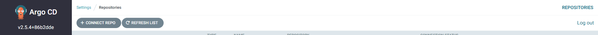
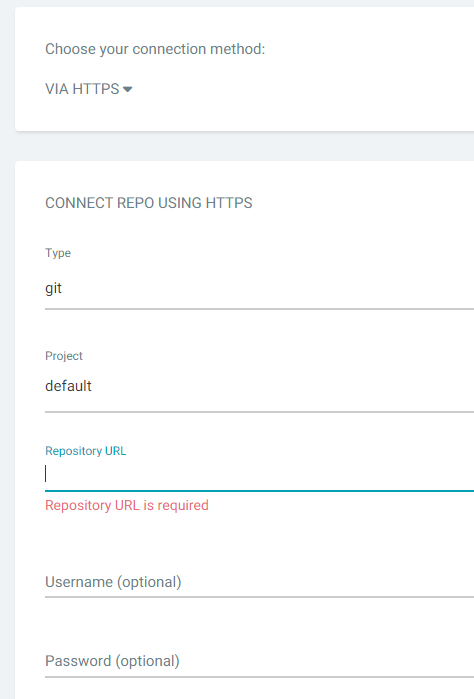

# ArgoCD

ArgoCD는 GitOps 방식으로 관리되는 Manifest 파일의 변경사항을 감시하며, 현재 배포된 환경의 상태와 Github Manifest 파일에 정의된 상태를 동일하게 유지하는 역할을 수행한다.

## ArgoCD 설치

`argocd` namespace 생성 및 배포

```bash
kubectl create namespace argocd
```

```bash
kubectl apply -n argocd -f https://raw.githubusercontent.com/argoproj/argo-cd/stable/manifests/install.yaml
```

## ArogoCD CLI 설치

```bash
sudo curl -sSL -o /usr/local/bin/argocd https://github.com/argoproj/argo-cd/releases/latest/download/argocd-linux-amd64
chmod +x /usr/local/bin/argocd
```

## 외부 접근 설정

기본적으로 외부 주소로 노출되어 있지 않기 때문에 API 서버를 외부에서 접속할 수 있다.

1. Load Balancer로 설정

```bash
kubectl patch svc argocd-server -n argocd -p '{"spec": {"type": "LoadBalancer"}}'
```

1. NodePort로 설정

```bash
kubectl patch svc argocd-server -n argocd -p '{"spec": {"type": "NodePort"}}'
```

## ArgoCD 로그인

ArgoCD의 로그인 계정은 admin이고, admin 계정 암호는 다음 명령으로 확인할 수 있다.

```bash
kubectl -n argocd get secret argocd-initial-admin-secret -o jsonpath="{.data.password}" | base64 -d; echo
```

## CodeCommit 레포 등록





Username과 Password는 CodeCommit의 AccessKey와 PrivateKey를 등록한다.