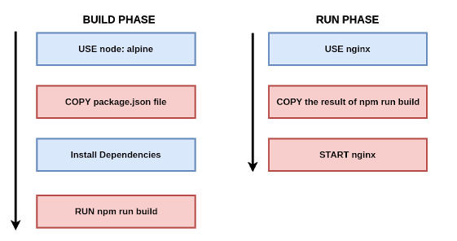

# Docker

## Docker Engine 설치

```bash
sudo apt install ca-certificates curl gnupg lsb-release
```

```bash
curl -fsSL https://download.docker.com/linux/ubuntu/gpg | sudo gpg --dearmor -o /usr/share/keyrings/docker-archive-keyring.gpg
```

```bash
echo \
  "deb [arch=$(dpkg --print-architecture) signed-by=/usr/share/keyrings/docker-archive-keyring.gpg] https://download.docker.com/linux/ubuntu \
  $(lsb_release -cs) stable" | sudo tee /etc/apt/sources.list.d/docker.list > /dev/null
```

```bash
sudo apt update
```

```bash
sudo apt install docker-ce docker-ce-cli containerd.io docker-compose-plugin
```

```bash
sudo usermod -aG docker ubuntu
sudo usermod -aG docker jenkins
```

## 멀티스테이지 빌드
컨테이너 이미지를 만들면서 빌드 등에는 필요하지만, 최종 컨테이너 이미지에는 필요없는 환경을 제거할 수 있도록 단계를 나누어 이미지를 만드는 방법이다.



멀티스테이지 빌드를 사용하게 되면 상기의 그림처럼 컨테이너 실행 시에는 빌드에 사용한 파일 및 디렉터리와 같은 의존 파일들이 모두 삭제된 상태로 컨테이너가 실행되게 된다. 결론적으로 더 가벼운 크기의 컨테이너를 사용할 수 있게 된다.

```
FROM golang:1.7.3 AS builder
WORKDIR /go/src/github.com/ddung1203/hello-world/
RUN go get -d -v golang.org/x/net/html
COPY app.go    .
RUN CGO_ENABLED=0 GOOS=linux go build -a -installsuffix cgo -o app .

FROM alpine:latest
RUN apk --no-cache add ca-certificates
WORKDIR /root/
COPY --from=builder /go/src/github.com/ddung1203/hello-world/app .
CMD ["./app"]
```
## CAdvisor

CAdvisor는 구글이 만든 컨테이너 모니터링 도구로, 컨테이너로서 간단히 설치할 수 있고 컨테이너별 실시간 자원 사용량 및 도커 모니터링 정보 등을 시각화해서 보여준다. CAdvisor는 오픈소스로서 GitHub 및 DockerHub에서 배포되고 있다.

``` bash
docker run \          
--volume=/:/roofts:ro \
--volume=/var/run:/var/run:ro \
--volume=/sys:/sys:ro \
--volume=/var/lib/docker/:/var/lib/docker:ro \
--volume=/dev/disk/:/dev/disk:ro \
--publish=8080:8080 \
--detach=true \
--name=cadvisor \
google/cadvisor:latest
```

`Subcontainers` 항목의 `/docker`를 클릭하면 도커 데몬의 정보, 컨테이너의 목록을 보여주는 페이지로 이동한다. `Subcontainers` 항목의 컨테이너 이름을 클릭하면 컨테이너의 자원 사용률도 실시간으로 확인할 수 있다.

CAdvisor는 도커 데몬의 정보를 가져올 수 있는 호스트의 모든 디렉터리를 CAdvisor 컨테이너에 볼륨으로서 마운트했기 때문이다. `/var/run`에는 도커를 로컬에서 제어하기 위한 유닉스 소켓이 있고, `/sys`에는 도커 컨테이너를 위한 cgroup 정보가 저장돼 있으며 `/var/lib/docker`에는 도커의 컨테이너, 이미지 등이 파일로 존재한다.

다만, 여러 개의 호스트로 도커를 사용하고 있으며, 이를 기반으로 PaaS 같은 도커 클러스터를 구축했다면 단일 CAdvisor 컨테이너는 용도에 맞지 않다. 이를 위해서 보통은 K8s나 스웜 모드 등과 같은 오케스트레이션 툴을 설치한 뒤에 Prometheus, InfluxDB 등을 이용해 여러 호스트의 데이터를 수집하는 것이 일반적이다.