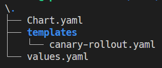

# Helm

## Helm 설치

최신 릴리즈 다운로드 후 설치

```bash
curl -fsSL -o get_helm.sh https://raw.githubusercontent.com/helm/helm/main/scripts/get-helm-3
chmod 700 get_helm.sh
./get_helm.sh
```

## Helm 환경 생성

```bash
helm create ./
```



- Chart.yaml : helm chart에 대한 정보가 담겨있음
- values.yaml : helm chart에서 사용하는 각종 값들에 대한 정의
- templates : kubernetes를 정의하는 manifest file이 담겨있는 폴더

아래의 manifest를 탬플릿처럼 만들어서 각 `{{ }}` 안에 들어갈 값만 바인딩이 될 수 있다면 여러 개의 어플리케이션들 마다 개별적인 manifest를 만들지 않고도 manifest를 재활용할 수 있다.

이런 작업을 해주는 것이 Helm이다.

Helm은 쿠버네티스의 패키지 매니저이다. 따라서 Helm은 쿠버네티스에서 패키징, 구성 및 설정, 배포에 관련된 작업들을 보다 수월하게 할 수 있도록 도와준다.

그러기 위해서 Helm은 Chart라는 개념을 사용하며, Chart란 사전에 구성된 쿠버네티스 manifest들을 말한다.

새로운 manifest를 만들 필요 없이 values.yaml의 내용만 아래 내용으로 변경하고 동일하게 배포하면 된다.

`Chart.yaml`

```yaml
apiVersion: v1
name: cheonga-market
description: This is Myweb App Helm chart for Kubernetes
version: 0.1.0
```

`valuess.yaml`

```yaml
app_name: cheonga-market-deployment
app_label: cheonga-market
app_image: <이미지레포>/<레포이름>:1
```

`canary-rollout.yaml`

canary 배포에 대해선 배포 전략에서 다루겠다.

```yaml
apiVersion: argoproj.io/v1alpha1
kind: Rollout
metadata:
  name: {{ .Values.app_name }}
spec:
  revisionHistoryLimit: 3
  selector:
    matchLabels:
      app: {{ .Values.app_label }}
  template:
    metadata:
      labels:
        app: {{ .Values.app_label }}
    spec:
      containers:
      - name: {{ .Values.app_name }}
        image: {{ .Values.app_image }}
        imagePullPolicy: Always
        ports:
        - containerPort: 8080
        resources:
          requests:
            cpu: "800m"
            memory: "800M"
          limits:
            cpu: "800m"
            memory: "800M"
  strategy:
    canary:
      maxSurge: "25%"
      maxUnavailable: 0
      steps:
      - setWeight: 25
      - pause: { duration: 10m }
---
apiVersion: v1
kind: Service
metadata:
  name: {{ .Values.app_name }}
spec:
  type: LoadBalancer
  selector:
    app: {{ .Values.app_label }}
  ports:
    - port: 80
      targetPort: 8080
---
apiVersion: autoscaling/v1
kind: HorizontalPodAutoscaler
metadata:
  name: {{ .Values.app_name }}
spec:
  scaleTargetRef:
    apiVersion: argoproj.io/v1alpha1
    kind: Rollout
    name: {{ .Values.app_name }}
  minReplicas: 1
  maxReplicas: 3
  targetCPUUtilizationPercentage: 50
```

정리하자면 Helm이란 manifest에 특정 값을 바인딩해서 새로운 manifest를 만들 수 있는 기능을 제공해주는 오픈소스 라이브러리이다.