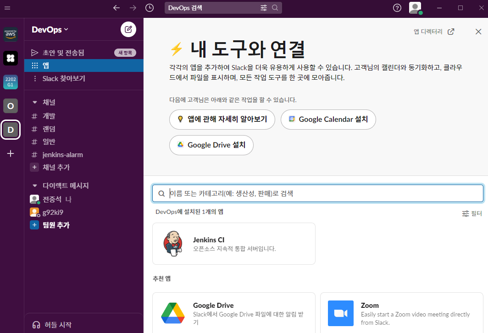
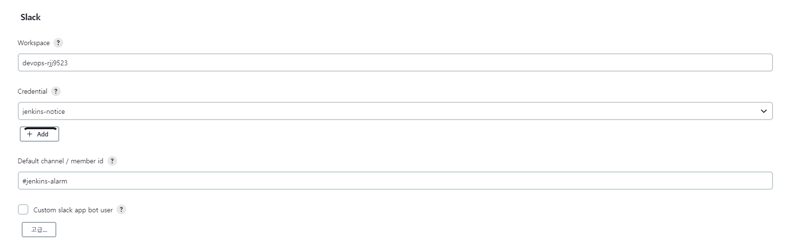

# Jenkins

Jenkins는 Java로 빌드 된 CI 및 CD 도구이며, Jenkins는 기본적으로 소프트웨어 프로젝트를 빌드, 테스트 및 배포하기 위해서 사용한다.

JDK 11 설치 (11버전 이상 필수)

```bash
sudo apt-get install openjdk-11-jdk
```

- Jenkins 저장소 Key 다운로드
- sources.list 추가
- Key 등록
- apt-get 재 업데이트
- Jenkins 설치

```bash
curl -fsSL https://pkg.jenkins.io/debian-stable/jenkins.io.key | sudo tee \
  /usr/share/keyrings/jenkins-keyring.asc > /dev/null
echo deb [signed-by=/usr/share/keyrings/jenkins-keyring.asc] \
  https://pkg.jenkins.io/debian-stable binary/ | sudo tee \
  /etc/apt/sources.list.d/jenkins.list > /dev/null
sudo apt-get update
sudo apt-get install jenkins
```

참고

[Linux](https://www.jenkins.io/doc/book/installing/linux/#debianubuntu)

Jenkins를 처음 설치하면 아래 경로에 비밀번호 파일이 생성되고, 처음 접속 시에 사용해야 한다.

```bash
sudo cat /var/lib/jenkins/secrets/initialAdminPassword
```

Jenkins에서 docker build 시 다음 에러와 함께 permission denied 에러가 발생한다.

```
Got permission denied while trying to connect to the Docker daemon socket at unix:///var/run/docker.sock: Post "http://%2Fvar%2Frun%2Fdocker.sock/v1.24/build?buildargs=%7B%7D&cachefrom=%5B%5D&cgroupparent=&cpuperiod=0&cpuquota=0&cpusetcpus=&cpusetmems=&cpushares=0&dockerfile=Dockerfile&labels=%7B%7D&memory=0&memswap=0&networkmode=default&rm=1&shmsize=0&t=my-app%3Alatest&target=&ulimits=null&version=1": dial unix /var/run/docker.sock: connect: permission denied
```

Jenkins 유저가 docker에 접근할 권한을 설정해야 한다.

다음 명령을 통해 docker에 권한을 부여한다.

```bash
sudo usermod -aG docker jenkins
sudo service jenkins restart
```

```yaml
pipeline {
  agent any

  environment{
    githubCredential='<깃헙 크리덴셜>'
    AWS_CREDENTIAL_NAME='<AWS 크리덴셜>'
    gitEmail='ddung1203@gsneotek.com'
    gitName='Joongseok Jeon'
  }

  stages {
    stage('Checkout Application Git Branch') {
      steps {
        checkout([$class: 'GitSCM', branches: [[name: '*/master']], extensions: [], userRemoteConfigs: [[credentialsId: githubCredential, url: '<깃 주소>']]])
      }
      post {
        failure {
          echo 'Repository Clone Failure' 
          slackSend (color: '#FF0000', message: "FAILED: Repository Clone Failure")
        }
        success {
          echo 'Repository Clone Success' 
          slackSend (color: '#0AC9FF', message: "SUCCESS: Repository Clone Success")
        }
      }
    }

    stage('MVN Clean Package') {
      steps {
        sh "mvn clean package"
      }
      post {
        failure {
          echo 'MVN Build Failure' 
          slackSend (color: '#FF0000', message: "FAILED: MVN Build Failure")
        }
        success {
          echo 'MVN Build Success' 
          slackSend (color: '#0AC9FF', message: "SUCCESS: MVN Build Success")
        }
      }
    }
    
    stage('Docker Image Build') {
      steps{
        sh "docker build -t cheonga-market ."
        sh "docker tag <도커 계정>/<도커 레포>:${BUILD_NUMBER}"
        sh "docker tag <도커 계정>/<도커 레포>:latest"
      }
      post {
        success {
          echo "The Docker Image Build stage successfully."
          slackSend (color: '#0AC9FF', message: "SUCCESS: Docker Image Build SUCCESS")
        }
        failure {
          echo "The Docker Image Build stage failed."
          slackSend (color: '#FF0000', message: "FAILED: Docker Image Build FAILED")
        }
      }
    }

    stage('Docker Image ECR Upload'){
      steps {
        script{
          docker.withRegistry("<ECR 레포>", "ecr:ap-northeast-2:${AWS_CREDENTIAL_NAME}") {
                      docker.image("<도커 계정>/<도커 레포>:${BUILD_NUMBER}").push()
                      docker.image("<도커 계정>/<도커 레포>:latest").push()
                    }
        }
      }
      post {
        success {
          echo "The deploy stage successfully."
          slackSend (color: '#0AC9FF', message: "SUCCESS: Docker Image ECR Upload SUCCESS")
        }
        failure {
          echo "The deploy stage failed."
          slackSend (color: '#FF0000', message: "FAILED: Docker Image ECR Upload FAILED")
        }
      }
    }

    stage('Kubernetes Manifest Update') {
      steps {
        git credentialsId: githubCredential,
            url: '<깃 주소>',
            branch: 'master'  

        // 이미지 태그 변경 후 메인 브랜치에 push
        sh "git config --global user.email ${gitEmail}"
        sh "git config --global user.name ${gitName}"
        sh "sed -i 's/cheonga-market:.*/cheonga-market:${currentBuild.number}/g' argocd/values.yaml"
        sh "git add ."
        sh "git commit -m 'fix:cheonga-market ${currentBuild.number} image versioning'"
        sh "git branch -M master"
        sh "git remote remove origin"
        sh "git remote add origin <ssh 깃 주소>"
        sh "git checkout master"
        sh "git push -u origin master"
      }
      post {
        failure {
          echo 'Kubernetes Manifest Update failure'
          slackSend (color: '#FF0000', message: "FAILED: Kubernetes Manifest Update '${env.JOB_NAME} [${env.BUILD_NUMBER}]' (${env.BUILD_URL})")
         }
        success {
          echo 'Kubernetes Manifest Update success'
          slackSend (color: '#0AC9FF', message: "SUCCESS: Kubernetes Manifest Update '${env.JOB_NAME} [${env.BUILD_NUMBER}]' (${env.BUILD_URL})")
          }
      }
    }
  }
}
```

## Jenkins SSH Git

CodeCommit 계정에 현재 인스턴스의 Jenkins 호스트 공개키를 등록했기 때문에 ssh 방식으로 깃 클론이 가능하다. 아래와 같이 소스를 가져와 클러스터를 생성한다.

```bash
sudo su jenkins

ssh-keygen

cat .ssh/id_rsa.pub
```

이후 AWS 사용자 세부 정보 페이지에서 Security Credentials(보안 자격 증명) 탭을 선택한 다음 Upload SSH public key(SSH 퍼블릭 키 업로드)를 선택한다.

`.ssh/config` 에 다음을 추가한다.

```bash
Host git-codecommit.*.amazonaws.com
  User APKAEIBAERJR2EXAMPLE
  IdentityFile ~/.ssh/id_rsa
```

다음 명령을 실행하여 SSH 구성을 테스트한다.

```bash
ssh git-codecommit.ap-northeast-2.amazonaws.com
```

## Slack 연동

앱을 열어서 추가하고자 하는 워크스페이스에 들어가 앱 추가를 한다.



이후 토큰이 발급되면 Jenkins 내에서 아래와 같이 등록을 끝마친다.



다음과 같이 성공을 확인할 수 있다.

