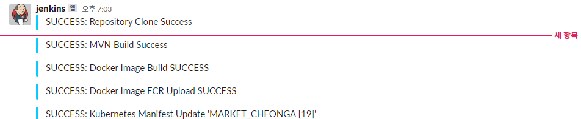
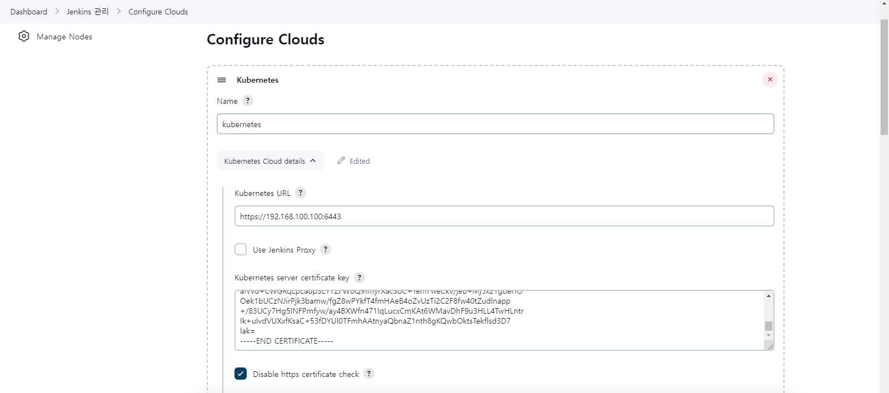
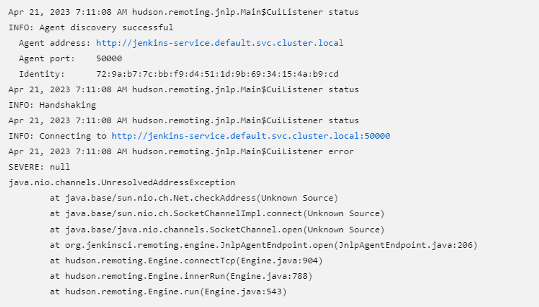
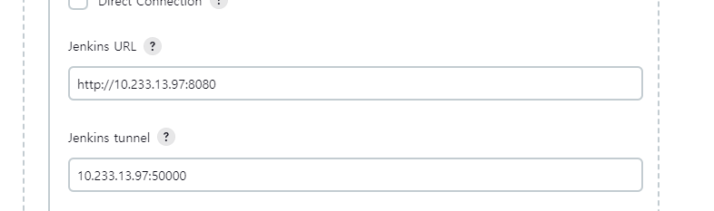
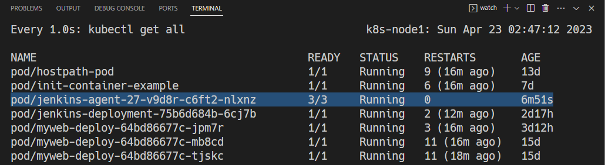
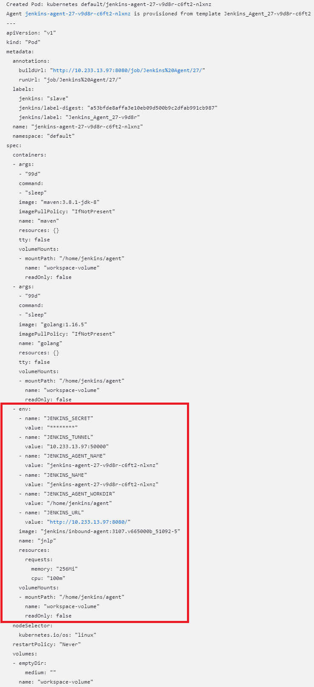
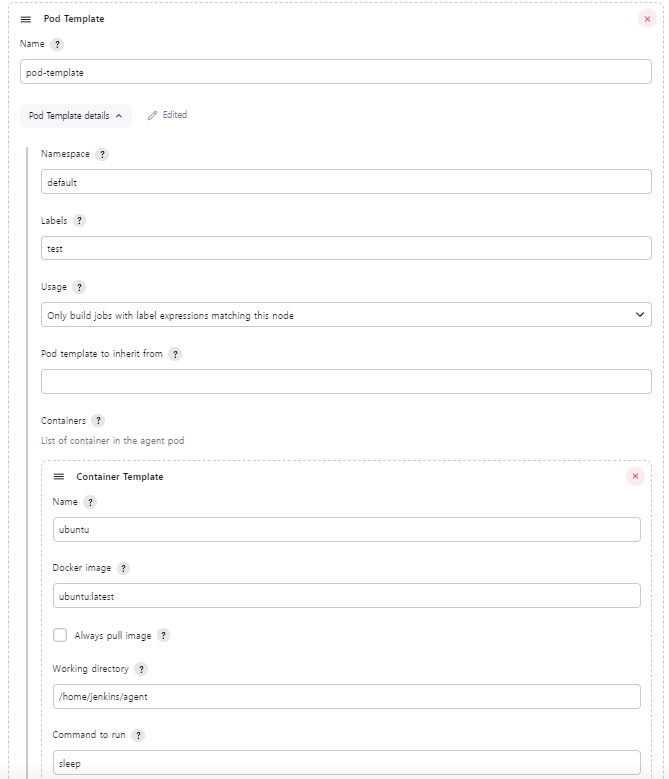
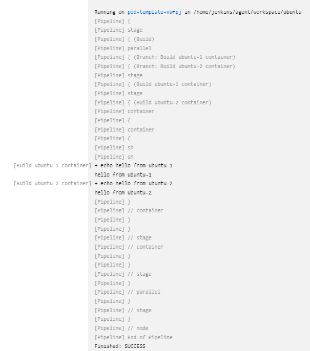

# Jenkins

Jenkins는 Java로 빌드 된 CI 및 CD 도구이며, Jenkins는 기본적으로 소프트웨어 프로젝트를 빌드, 테스트 및 배포하기 위해서 사용한다.

JDK 11 설치 (11버전 이상 필수)

```bash
sudo apt-cache search openjdk
```

```bash
sudo apt-get install openjdk-11-jdk
```

java path 조회

```bash
which java

ls -l /usr/bin/java
# link된 주소 재 조회
ls -l /etc/alternatives/java
```

조회된 path 환경변수 추가

```bash
/usr/lib/jvm/java-11-openjdk-amd64
```

- Jenkins 저장소 Key 다운로드
- sources.list 추가
- Key 등록
- apt-get 재 업데이트
- Jenkins 설치

```bash
curl -fsSL https://pkg.jenkins.io/debian-stable/jenkins.io.key | sudo tee \
  /usr/share/keyrings/jenkins-keyring.asc > /dev/null
echo deb [signed-by=/usr/share/keyrings/jenkins-keyring.asc] \
  https://pkg.jenkins.io/debian-stable binary/ | sudo tee \
  /etc/apt/sources.list.d/jenkins.list > /dev/null
sudo apt-get update
sudo apt-get install jenkins
```

참고

[Linux](https://www.jenkins.io/doc/book/installing/linux/#debianubuntu)

Jenkins를 처음 설치하면 아래 경로에 비밀번호 파일이 생성되고, 처음 접속 시에 사용해야 한다.

```bash
sudo cat /var/lib/jenkins/secrets/initialAdminPassword
```

Jenkins에서 docker build 시 다음 에러와 함께 permission denied 에러가 발생한다.

```
Got permission denied while trying to connect to the Docker daemon socket at unix:///var/run/docker.sock: Post "http://%2Fvar%2Frun%2Fdocker.sock/v1.24/build?buildargs=%7B%7D&cachefrom=%5B%5D&cgroupparent=&cpuperiod=0&cpuquota=0&cpusetcpus=&cpusetmems=&cpushares=0&dockerfile=Dockerfile&labels=%7B%7D&memory=0&memswap=0&networkmode=default&rm=1&shmsize=0&t=my-app%3Alatest&target=&ulimits=null&version=1": dial unix /var/run/docker.sock: connect: permission denied
```

Jenkins 유저가 docker에 접근할 권한을 설정해야 한다.

다음 명령을 통해 docker에 권한을 부여한다.

```bash
sudo usermod -aG docker jenkins
sudo service jenkins restart
```

```yaml
pipeline {
  agent any

  environment {
    githubCredential='<깃헙 크리덴셜>'
    AWS_CREDENTIAL_NAME='<AWS 크리덴셜>'
    gitEmail='ddung1203@gsneotek.com'
    gitName='Joongseok Jeon'
  }

  stages {
    stage('Checkout Application Git Branch') {
      steps {
        checkout([$class: 'GitSCM', branches: [[name: '*/master']], extensions: [], userRemoteConfigs: [[credentialsId: githubCredential, url: '<깃 주소>']]])
      }
      post {
        failure {
          echo 'Repository Clone Failure'
          slackSend (color: '#FF0000', message: "FAILED: Repository Clone Failure")
        }
        success {
          echo 'Repository Clone Success'
          slackSend (color: '#0AC9FF', message: "SUCCESS: Repository Clone Success")
        }
      }
    }

    stage('MVN Clean Package') {
      steps {
        sh "mvn clean package"
      }
      post {
        failure {
          echo 'MVN Build Failure'
          slackSend (color: '#FF0000', message: "FAILED: MVN Build Failure")
        }
        success {
          echo 'MVN Build Success'
          slackSend (color: '#0AC9FF', message: "SUCCESS: MVN Build Success")
        }
      }
    }

    stage('Docker Image Build') {
      steps{
        sh "docker build -t cheonga-market ."
        sh "docker tag <도커 계정>/<도커 레포>:${BUILD_NUMBER}"
        sh "docker tag <도커 계정>/<도커 레포>:latest"
      }
      post {
        success {
          echo "The Docker Image Build stage successfully."
          slackSend (color: '#0AC9FF', message: "SUCCESS: Docker Image Build SUCCESS")
        }
        failure {
          echo "The Docker Image Build stage failed."
          slackSend (color: '#FF0000', message: "FAILED: Docker Image Build FAILED")
        }
      }
    }

    stage('Docker Image ECR Upload'){
      steps {
        script{
          docker.withRegistry("<ECR 레포>", "ecr:ap-northeast-2:${AWS_CREDENTIAL_NAME}") {
                      docker.image("<도커 계정>/<도커 레포>:${BUILD_NUMBER}").push()
                      docker.image("<도커 계정>/<도커 레포>:latest").push()
                    }
        }
      }
      post {
        success {
          echo "The deploy stage successfully."
          slackSend (color: '#0AC9FF', message: "SUCCESS: Docker Image ECR Upload SUCCESS")
        }
        failure {
          echo "The deploy stage failed."
          slackSend (color: '#FF0000', message: "FAILED: Docker Image ECR Upload FAILED")
        }
      }
    }

    stage('Kubernetes Manifest Update') {
      steps {
        git credentialsId: githubCredential,
            url: '<깃 주소>',
            branch: 'master'

        // 이미지 태그 변경 후 메인 브랜치에 push
        sh "git config --global user.email ${gitEmail}"
        sh "git config --global user.name ${gitName}"
        sh "sed -i 's/cheonga-market:.*/cheonga-market:${currentBuild.number}/g' argocd/values.yaml"
        sh "git add ."
        sh "git commit -m 'fix:cheonga-market ${currentBuild.number} image versioning'"
        sh "git branch -M master"
        sh "git remote remove origin"
        sh "git remote add origin <ssh 깃 주소>"
        sh "git checkout master"
        sh "git push -u origin master"
      }
      post {
        failure {
          echo 'Kubernetes Manifest Update failure'
          slackSend (color: '#FF0000', message: "FAILED: Kubernetes Manifest Update '${env.JOB_NAME} [${env.BUILD_NUMBER}]' (${env.BUILD_URL})")
        }
        success {
          echo 'Kubernetes Manifest Update success'
          slackSend (color: '#0AC9FF', message: "SUCCESS: Kubernetes Manifest Update '${env.JOB_NAME} [${env.BUILD_NUMBER}]' (${env.BUILD_URL})")
        }
      }
    }
  }
}
```

## Jenkins SSH Git

CodeCommit 계정에 현재 인스턴스의 Jenkins 호스트 공개키를 등록했기 때문에 ssh 방식으로 깃 클론이 가능하다. 아래와 같이 소스를 가져와 클러스터를 생성한다.

```bash
sudo su jenkins

ssh-keygen

cat .ssh/id_rsa.pub
```

이후 AWS 사용자 세부 정보 페이지에서 Security Credentials(보안 자격 증명) 탭을 선택한 다음 Upload SSH public key(SSH 퍼블릭 키 업로드)를 선택한다.

`.ssh/config` 에 다음을 추가한다.

```bash
Host git-codecommit.*.amazonaws.com
  User APKAEIBAERJR2EXAMPLE
  IdentityFile ~/.ssh/id_rsa
```

다음 명령을 실행하여 SSH 구성을 테스트한다.

```bash
ssh git-codecommit.ap-northeast-2.amazonaws.com
```

## Slack 연동

앱을 열어서 추가하고자 하는 워크스페이스에 들어가 앱 추가를 한다.


이후 토큰이 발급되면 Jenkins 내에서 아래와 같이 등록을 끝마친다.


다음과 같이 성공을 확인할 수 있다.



## Jenkins Node

Jenkins Pipeline을 다루기 전에, Jenkins 안에서 DOOD(Docker Out Of Docker)로 Docker Agent를 실행하는 방법을 다루겠다.
필요한 라이브러리를 직접 설치하거나 하지 않고 Jenkins Pipeline 스크립트 안에서 Docker Agent를 이용해 설치하려면 별도로 의존성있는 라이브러리를 직접 설치하지 않아도 되고, Jenkins에서 Docker image를 빌드할 때도 필요하다.

Docker 안에 Docker를 띄우는 것이긴 하지만 DID(Docker In Docker) 방식처럼 독립적으로 띄우지는 않을 것이고, Host Docker의 docker.sock을 공유해서 DOOD 방식으로 띄울 것이다. DID는 존재하지만 권장하는 방법이 아니다.

Jenkins에서 Docker 빌드를 위한 Agent를 사용하면 Jenkins Master와 Agent를 분리하여 Docker/Kubernetes 안에서 Agent를 실행할 수 있습니다. 이렇게 하면 Docker 빌드를 위해 필요한 자원을 관리하기 쉬워지고, Kubernetes를 사용하여 작업을 더 효율적으로 관리할 수 있다.

그렇다고, DOOD가 단점이 없는 것은 아니다. Jenkins container 내부에서 `docker ps` 명령을 보내면 자기 자신의 container가 떠있는 것이 목록에 보인다. 즉, 외부 호스트 Docker에 올라와있는 container에 접근이 가능하게 될 수도 있다는 뜻이다. 또한 docker.sock을 공유하기 위해 그만큼의 권한을 Docker container에게 제공해야 한다.

공식 Jenkins 이미지 안에는 Docker Engine이 설치되어 있지 않기 때문에 Docker Engine이 설치되어 있는 Jenkins가 필요하기 때문에 커스텀하여 이미지를 다시 생성해야 한다.

`docker_install.sh`

```bash
#!/bin/sh
apt-get update && \
apt-get -y install apt-transport-https \
     ca-certificates \
     curl \
     gnupg2 \
     zip \
     unzip \
     software-properties-common && \
curl -fsSL https://download.docker.com/linux/$(. /etc/os-release; echo "$ID")/gpg > /tmp/dkey; apt-key add /tmp/dkey && \
add-apt-repository \
   "deb [arch=amd64] https://download.docker.com/linux/$(. /etc/os-release; echo "$ID") \
   $(lsb_release -cs) \
   stable" && \
apt-get update && \
apt-get -y install docker-ce
```

`Dockerfile`

```
#공식 젠킨스 이미지를 베이스로 한다.
FROM jenkins/jenkins:lts

#root 계정으로 변경(for docker install)
USER root

#DIND(docker in docker)를 위해 docker 안에서 docker를 설치
COPY docker_install.sh /docker_install.sh
RUN chmod +x /docker_install.sh
RUN /docker_install.sh

RUN usermod -aG docker jenkins
USER jenkins
```

그 다음 Jenkins를 띄울 서버에 방금 만든 이미지로 Jenkins를 띄운다.

```bash
docker run -d --name jenkins -p 8080:8080 -p 50000:50000 \
        -v /home/deploy/jenkins_v:/var/jenkins_home \
        -v /var/run/docker.sock:/var/run/docker.sock \
        ddung1203/jenkins-dind:latest
```

> Host 시스템의 포트 50000에 매핑
> JNLP 기반 Jenkins 에이전트를 하나 이상의 다른 기계에 설치한 경우 필요
> JNLP 기반 Jenkins 에이전트는 기본적으로 50000 포트를 통해 Jenkins 마스터와 통신을 한다. 글로벌 보안 구성 페이지를 통해 Jenkins 마스터에서 이 포트 번호를 변경할 수 있음

중요한 것은 Host의 docker.sock을 공유해서 사용할 것임으로 Volume Mount가 필요하다.

```bash
> docker exec -it jenkins bash

jenkins@20ff53d54e94:/$ docker ps
CONTAINER ID        IMAGE                         COMMAND                  CREATED             STATUS              PORTS                                              NAMES
20ff53d54e94        ddung1203/jenkins-dind:latest   "/sbin/tini -- /usr/…"   35 minutes ago      Up 35 minutes       0.0.0.0:8080->8080/tcp, 0.0.0.0:50000->50000/tcp   jenkins
```

docker.sock Volume Mount에 관해 permission denied가 발생한다면 하기와 같이 Host에서 docker.sock에 접근할 수 있는 권한을 부여한다.

```bash
# docker.sock 접근 권한
sudo chmod 666 /var/run/docker.sock

sudo groupadd docker
sudo usermod -aG docker deploy
```

## Kubernetes 연동을 통한 Jenkins Agent 관리

Jenkins에서는 보통 Jenkins Master와 Agent를 분리해서 Job을 처리하는 경우가 많은데, 이런 경우 Agent를 수동으로 설정하지 않고, Jenkins의 Kubernetes 플러그인을 연동해서 Kubernetes 클러스터를 통해 필요할 때만 동적으로 Agent Pod를 생성/사용되게 할 수 있다.

`Manage Jenkins -> Manage Nodes and Clouds -> Configure Clouds` 에서 하기 그림과 같이 설정한다.



Test Connection으로 정상 작동을 확인한다.

만약 외부 Jenkins에서 Kubernetes 클러스터를 연동하려면 상기 그림과 같이 별도의 Credential 설정이 필요하다.

즉, Kubernetes 클러스터 내부 Jenkins에서 연동 시 별도의 Credential이 필요없다.

> 
>
> Jenkins tunnel 주소에 `http://` 접두사를 추가한 경우 상기와 같이 오류가 발생한다. 따라서 하기와 같이 `host:port` 형식이어야 한다.
>
> 
>
> 참고: [StackOverflow](https://stackoverflow.com/questions/71508629/unresolvedaddressexception-when-connecting-jnlp-slave-to-jenkins-master)

### Sample Pipeline

```Groovy
podTemplate(containers: [
  containerTemplate(name: 'maven', image: 'maven:3.8.1-jdk-8', command: 'sleep', args: '99d'),
  containerTemplate(name: 'golang', image: 'golang:1.16.5', command: 'sleep', args: '99d')
 ]) {

  node(POD_LABEL) {
    stage('Get a Maven project') {
      git 'https://github.com/jenkinsci/kubernetes-plugin.git'
      container('maven') {
        stage('Build a Maven project') {
          sh 'mvn -B -ntp clean install'
        }
      }
    }

    stage('Get a Golang project') {
      git url: 'https://github.com/hashicorp/terraform.git', branch: 'main'
      container('golang') {
        stage('Build a Go project') {
          sh '''
          mkdir -p /go/src/github.com/hashicorp
          ln -s `pwd` /go/src/github.com/hashicorp/terraform
          cd /go/src/github.com/hashicorp/terraform && make
          '''
        }
      }
    }
  }
}
```



kubectl로 Pod를 보면 파이프라인을 수행하기 전에 빌드를 수행할 Pod의 내용을 확인할 수 있으며 샘플 스크립트에서 정의한 PodTemplate에 jnlp 컨테이너가 자동으로 추가된 것을 확인할 수 있다.

jnlp 컨테이너에 jenkins agent가 실행되고 jenkins master와 통신하는 역할을 하는데 플러그인이 자동으로 Pod에 추가한 것이다.



샘플 Pipeline 스크립트를 통해 정상적으로 작동되는 것을 확인이 가능하다.

### Global Pod Template

Jenkins 시스템 설정에서 Kubernetes plugin을 설정했던 페이지에 Pod Template을 정의할 수 있다.



상기와 같이 Pod에 필요한 정보를 입력한다.

그 외 Pod 설정에, 특정 Node에서 작동하게 하려면 nodeSelector, env, hostPath volume 등 Kubernetes Pod에 필요한 기존 정보들을 대부분 설정할 수 있다. 특히 Labels 같은 경우 pipeline 스크립트에서 쓸 노드를 명시할 때 쓰이므로 유니크한 이름으로 지정해야 한다.

위 예시에서는 하나의 Pod에 `ubuntu`라는 컨테이너가 ubuntu 이미지를 사용하게 설정하였다.

이렇게 Global Pod template을 한 번 정의해 두면 나중에 스크립트에서 이 template을 상속하여 merge 하거나 overwrite 할 수도 있다.

```Groovy
pipeline {
  agent {
    node {
      label 'test'
    }
  }

  stages {
    stage('Build') {
      parallel {
        stage('Build ubuntu-1 container') {
          steps {
            container('ubuntu-1') {
              sh "echo hello from $POD_CONTAINER"
            }
          }
        }
        stage('Build ubuntu-2 container') {
          steps {
            container('ubuntu-2') {
              sh "echo hello from $POD_CONTAINER"
            }
          }
        }
      }
    }
  }
}
```

Build stage에서 Agent를 생성해 Stage의 컨테이너에서 병렬로 수행하게 하는 예제이다. 하기와 같이 각 컨테이너에서 echo 명령을 실행 후 종료된다.



## Jenkins Helm Charts

Jenkins의 볼륨 유지와 백업 관리를 위해 Jenkins Helm chart를 이용하여 빠른 구성과 테스트를 진행한다.

helm repo

```bash
helm repo add jenkins https://charts.jenkins.io
helm repo update
```

helm value

```bash
helm show values jenkins/jenkins > jenkins-values.yaml
```

`controller.adminPassword`, `controller.serviceType`, `controller.agentListenerServiceType`, `persistence.storageClass` 구성 변경

[Jenkins Value 참고](https://github.com/jenkinsci/helm-charts/blob/main/charts/jenkins/VALUES_SUMMARY.md)
