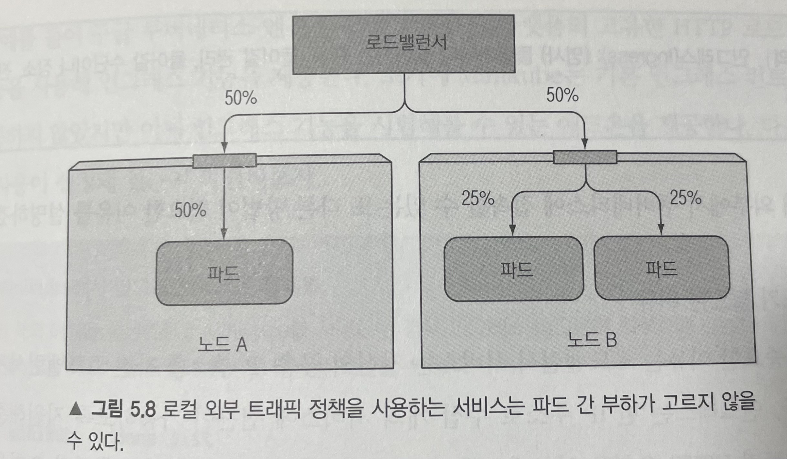

# Service

## 외부 연결의 특성 이해

### 클라이언트 IP가 보전되지 않음 인식

일반적으로 클러스터 내의 클라이언트가 서비스로 연결할 때 서비스의 파드는 클라이언트의 IP 주소를 얻을 수 있다. 그러나 노트포트로 연결을 수신하면 패킷에서 SNAT(소스 네트워크 주소 변환)이 수행되므로 패킷의 소스 IP가 변경된다.

파드는 실제 클라이언트의 IP를 볼 수 없다. 이는 클라이언트의 IP를 알아야 하는 일부 애플리케이션(웹 서버의 경우 액세스 로그에 브라우저의 IP를 표시)에서 문제가 될 수 있다.

해결 방법

1. ExternalTrafficPolicy 설정

`externalTrafficPolicy: Local`로 설정하면 NodePort 서비스는 원본 클라이언트 IP를 사용하여 트래픽을 전달하려고 시도하며, 이렇게 하면 클라이언트 IP를 알 수 있게 된다. 그러나 이 방법은 모든 노드에서 해당 서비스의 엔드포인트가 실행 중이어야 하며, 노드 간의 트래픽 부하가 균형을 맞추지 않을 수 있으므로 고려해야 한다.



2. 로깅 및 프록시

클라이언트 IP 주소를 로깅하려면 NodePort 서비스 뒤에 로깅 프록시를 두고 로그를 처리할 수 있다. 예를 들어, NGINX나 HAProxy와 같은 리버스 프록시를 사용하여 클라이언트 IP를 추출하고 로깅에 추가할 수 있다.

3. Ingress 컨트롤러 사용

Ingress 컨트롤러를 사용하면 클라이언트 IP를 쉽게 알 수 있다. Ingress 컨트롤러는 클라이언트 IP를 헤더로 전달하고 로깅에 사용할 수 있도록 구성할 수 있다.


## 헤드리스 서비스로 개별 파드 찾기

클라이언트가 모든 파드에 연결하려면 각 파드의 IP를 알아야 한다. 한 가지 옵션은 클라이언트가 쿠버네티스 API 서버를 호출해 파드와 IP 주소 목록을 가져오도록 하는 것이다. 하지만 애플리케이션을 쿠버네티스와 무관하게 유지하려고 노력해야 하기 때문에 항상 API 서버를 사용하는 것은 바람직하지 않다.

쿠버네티스는 클라이언트가 DNS 조회로 파드 IP를 찾을 수 있도록 한다. 일반적으로 서비스에 대한 DNS 조회를 수행하면 DNS 서버는 하나의 IP를 반환한다. 그러나 쿠버네티스 서비스에 클러스터 IP가 필요하지 않다면 DNS 서버는 하나의 서비스 IP 대신 파드 IP들을 반환한다.

DNS 서버는 하나의 DNS A 레코드를 반환하는 대신 서비스에 대한 여러 개의 A 레코드를 반환한다. 각 레코드는 해당 시점에 서비스를 지원하는 개별 파드의 IP를 가리킨다. 따라서 클라이언트는 간단한 DNS A 레코드 조회를 수행하고 서비스에 포함된 모든 파드의 IP를 얻을 수 있다. 그런 다음 클라이언트는 해당 정보를 사용해 하나 혹은 다수의 또는 모든 파드에 연결할 수 있다.

### DNS로 파드 찾기

하기는 각각 LoadBalancer의 `youtube-service`, 헤드리스 서비스의 `mongo-service`의 `nslookup` 조회 결과이다.

`LoadBalancer`
```bash
root@dnsutils:/# nslookup youtube-service.youtube
Server:		169.254.25.10
Address:	169.254.25.10#53

Name:	youtube-service.youtube.svc.cluster.local
Address: 10.233.25.134
```

`ClusterIP: None`
```bash
root@dnsutils:/# nslookup mongo-service.mongo
Server:		169.254.25.10
Address:	169.254.25.10#53

Name:	mongo-service.mongo.svc.cluster.local
Address: 10.233.75.47
Name:	mongo-service.mongo.svc.cluster.local
Address: 10.233.71.16
Name:	mongo-service.mongo.svc.cluster.local
Address: 10.233.102.150
```

헤드리스 서비스를 위해 반환된 DNS A 레코드를 보면, DNS 서버는 `mongo-service.mongo.svc.cluster.local` FQDN에 대해 서로 다른 세 개의 IP를 반환한다. 바로 준비 되었다고 보고된 파드 두 개의 IP다.

이는 `mongo-service` 서비스와 달리 `youtube-service`(헤드리스가 아닌) 서비스 DNS가 반환하는 것돠 다르다.

헤드리스 서비스는 일반 서비스와 다르게 보일 수 있지만 클라이언트의 관점에서는 다르지 않다. 헤드리스 서비스를 사용하더라도 클라이언트는 일반 서비스와 마찬가지로 서비스의 DNS 이름에 연결해 파드에 연결할 수 있다. 그러나 헤드리스 서비스에서는 DNS가 파드의 IP를 반환하기 때문에 클라이언트는 서비스 프록시 대신 파드에 직접 연결한다.

