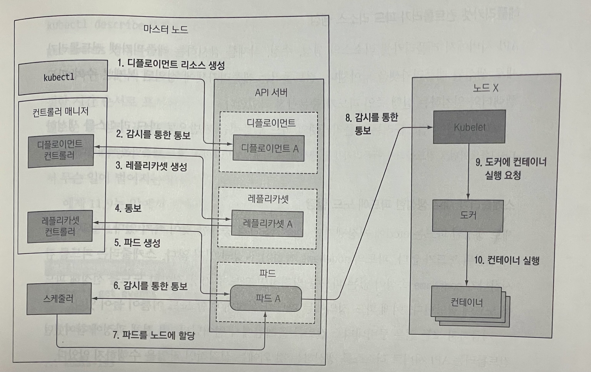
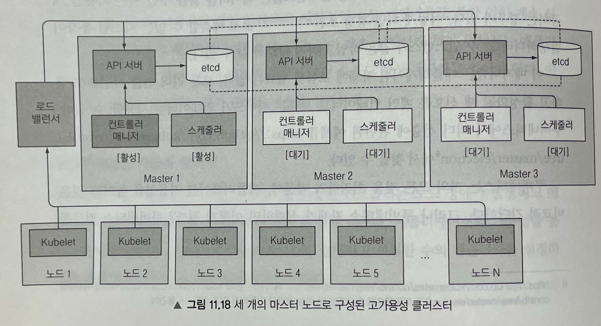

# Internal Service

## etcd

### 쿠버네티스가 etcd를 사용하는 방법

쿠버네티스 API 서버만이 etcd와 직접적으로 통신하는 유일한 구성 요소다. 다른 구성 요소는 API 서버로 간접적으로 데이터를 읽거나 쓸 수 있다. 이로써 낙관적 잠금 시스템뿐만 아니라 유효성을 검사하는 등의 이점을 얻을 수 있다.

**etcd의 일관성 보장**

고가용성을 보장하기 위해 두 개 이상의 etcd 인스턴스를 실행하는 것이 일반적이다. 이러한 분산 시스템은 실제 상태가 무엇인지 합의에 도당해야 한다. RAFT 합의 알고리즘을 사용해 어느 순가닝든 각 노드 상태가 대다수의 노드가 동의하는 현재 상태이거나 이전에 동의된 상태 중에 하나임을 보장한다.

합의 알고리즘은 클러스터가 다음 상태로 진행하기 위해 과반수가 필요하다. 클러스터가 연결이 끊어진 두 개의 노드 그룹으로 분리될 경우에, 이전 상태에서 새로운 상태로 전환하기 위해 필요한 과반을 확보할 수 없기 때문에 두 그룹의 상태는 달라질 수 없다. 만약에 한 그룹이 전체 노드의 과반을 가지고 있다면, 나머지 그룹은 명백하게 과반이 될 수 없다.

> 두 개의 인스턴스가 있으면 두 인스턴스 모두에 과반이 필요하다. 두 개의 인스턴스를 갖는 것이 하나일 때보다 오히려 좋지 않다. 두 개가 있으면, 전체 클러스터 장애 발생률이 단일 노드 클러스터에 비해 100% 증가한다.
> 
> 세 개와 네 개의 etcd 인스턴스를 비교할 때도 마찬가지다. 세 개의 인스턴스 중 인스턴스 하나가 실패할 경우라도 여전히 과반이 존재한다. 네 개의 인스턴스에서는 세 노드가 과반을 위해 필요하다. 세 개와 네 개 노드 클러스터는 단 하나의 노드 실패만 허용한다. 그러나 인스턴스가 네 개로 동작하고 있을 때, 하나가 실패한다면 높은 확률로 나머지 세 개 노드 중에 또 다른 노드가 실해팔 여지가 있다.

## 이벤트 체인

Deployment Manifest를 가진 YAML 파일을 준비해 쿠버네티스에 게시한다고 가정했을 때 하기 그림과 같이 연계된 이벤트가 발생하기 시작한다.

- Deployment Controller가 ReplicaSet 생성
- ReplicaSet Controller가 Pod Resource 생성
- Scheduler가 새로 생성한 Pod에 노드 할당
- Kubelet은 Pod의 컨테이너 실행

## Control Plane 구성 요소의 가용성

Control Plane은 하기와 같은 특징을 가지고 있다.

- etcd 클러스터
- 여러 API 서버 인스턴스
- 컨트롤러와 스테줄러의 고가용성
- 리더 선출 메커니즘

