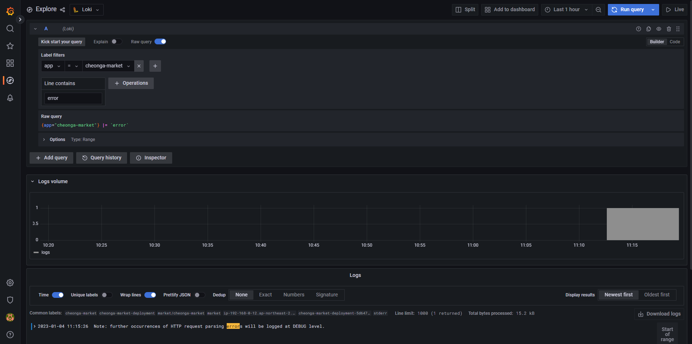

# Loki Logging System

Kubernetes 로그는 기존 VM 시스템과 다르게 로그가 저장되지 않고, Pod의 수도 많다. 이에 기존 VM 환경 로그 시스템이 아닌 새로운 통합 Log 시스템이 필요하다.

Loki는 기존에 많이 사용하는 ELK, FluentD 로그 시스템에 비하여 리소스도 작고 설치도 간단하여 많이 사용되고 있다.

기존 VM Legacy 로그 시스템 환경에서는 Application 로그를 보기 위해서 개별 서버 마다 접속해서 Applicaiton 별 로그 파일을 일일이 확인해야 한다. 각 Application 별로 저장하는 로그 파일 경로가 달라서 각 파일을 외우는 것도 쉽지 않다. 하지만 Application이 재시작 되어도 로그 파일은 사라지지 않고 항상 존재한다.

하지만 Kubernetes 컨테이너 환경의 경우 Pod 로그를 STDOUT으로 처리하도록 이미지를 생성한다. STDOUT 형태로 출력되는 로그는 각 서버마자 접속하여 tail -f {application별 로그 파일} 명령어로 확인하는 것이 아니라 원격 개인 PC에서 간단히 `kubectl logs -f {POD}` 를 하면 로그를 조회할 수 있다.

컨테이너는 휘발성이라 로그 역시 컨테이너가 Restart되면 사라진다. 만약 Pod가 Restart 되었다면, Application이 다운된 이유를 찾아야하는데, 로그가 없기 때문에 곤란해진다.

## Loki for Prometheus Logging

Grafana Loki는 Prometheus에 영감을 받아 탄생한 클라우트 네이티브 인프라를 위한 로깅 서비스이다.

Loki의 경우 단일 로그 라인을 그대로 처리하는 아이디어를 기반으로 만들어져 있어 전체 텍스트를 인덱싱하는 방식이 아닌 Label을 사용하여 로그를 그룹화하는 방식을 사용한다. 이 방식은 로그 처리에 대해 인덱싱을 하는 기존의 ElasticSearch와 비교하였을 때 훨씬 효율적이며 확장성이 좋다. 복잡한 작업이 필요 없고 로그들을 그룹화시켜 즉각적인 확인을 하고자 하였을 때 빛을 발휘한다.


설치는 Helm 차트를 이용하여 설치한다.

```bash
helm repo add grafana https://grafana.github.io/helm-charts
helm repo update

helm pull grafana/loki-stack
tar xvfz loki-stack-2.8.9.tgz

kubectl create ns loki

helm install loki . -n loki
```

Grafana Dashboard에 접속하여 Data Sources를 선택 후 Loki를 추가한다.


HTTP URL을 [`http://loki-headless.loki:3100`](http://loki-headless.loki:3100/) 을 작성한다.

이 URL은 service에서 확인이 가능하며 port 또한 확인이 가능하다.


화면 좌측 Explore를 선택하여 label을 지정할 수 있다. 현재 예시는 `app=cheonga-market` 을 레이블로 설정하였다.


로그가 너무 많기 때문에 적절한 filter를 통한 검색을 해야한다. Log 검색을 위해 Loki는 LogQL(Query Language)를 사용한다. Kubernetes Label을 기준으로 개별 Pod 로그를 grep하는 툴 이라 생각하면 된다.

Error Log만 보고싶을 때와 같은 필터링을 예시로 사용한 화면은 다음과 같다.

