# Prometheus Grafana

1. Prometheus-stack 설치
2. Grafana Prometheus-stack 빌트인 모니터링
3. AlertManager 설정

## Architecture


Kubernetes 환경에서는 Prometheus가 모니터링 표준이다. (2018년 CNCF Graduated)

간단하게 Helm으로 설치가 가능하다. 특히 Prometheus는 prometheus-stack으로 operator, grafana, alertmanager까지 한번에 설치가 가능한 Helm Chart를 제공한다.

링크는 아래와 같다.

[helm-charts/charts/kube-prometheus-stack at main · prometheus-community/helm-charts](https://github.com/prometheus-community/helm-charts/tree/main/charts/kube-prometheus-stack)

```bash
helm repo add prometheus-community https://prometheus-community.github.io/helm-charts
helm repo update
```

다음은 향후 관리를 수월하게 하기 위해 디렉토리를 관리하여 버저닝을 해준다.

```bash
helm pull prometheus-community/kube-prometheus-stack
tar xvfz kube-prometheus-stack/kube-prometheus-stack-43.2.1.tgz
mv kube-prometheus-stack kube-prometheus-statk-43.2.1
```

## Helm Chart 수정

+) History 확인을 위해 기존 values.yaml 파일을 복사하여 백업

- alertmanager, prometheus의 Service Type을 NodePort로 변경
- Prometheus의 resources를 알맞게 수정
- retention period 및 size 조정
    - 모니터링 데이터 유지하는 기간 및 용량을 설정

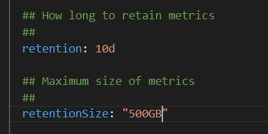

- PVC 관련 설정

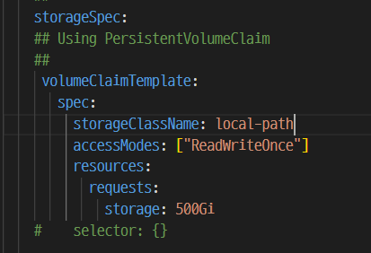

## 설치

```bash
kubectl create ns monitoring

helm install prometheus -f my-vaules.yaml . -n monitoring
```

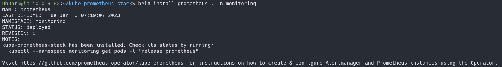

** https://raw.githubusercontent.com/kubernetes/website/master/content/en/examples/pods/storage/pv-volume.yaml

클러스터에 사용 가능한 스토리지 클래스가 있는지 확인을 우선 해야한다. 스토리지 클래스가 없다면 PVC를 생성할 수 없다.
따라서, `kubectl get storageclass` 를 통해 상기 이미지와 동일한 storageclass를 사전에 생성해야 한다.

위와 같이 배포 완료

혹은 간단하게 테스트를 하기 위함이라면,

```bash
kubectl patch svc prometheus-grafana -n monitoring -p '{"spec": {"type": "NodePort"}}'
kubectl patch svc prometheus-kube-prometheus-alertmanager -n monitoring -p '{"spec": {"type": "NodePort"}}'
kubectl patch svc prometheus-kube-prometheus-prometheus -n monitoring -p '{"spec": {"type": "NodePort"}}'
```

`patch` 명령어로 ClusterIP를 NodePort로 변경해준다.

Grafana를 접속한 후 로그인 창을 확인할 수 있다.

username은 admin, password는 `my-vaules.yaml` 내에 사용자 정의한 password를 입력한다.

로그인 후 Configuration 탭에서 Data Sources를 확인해보면,

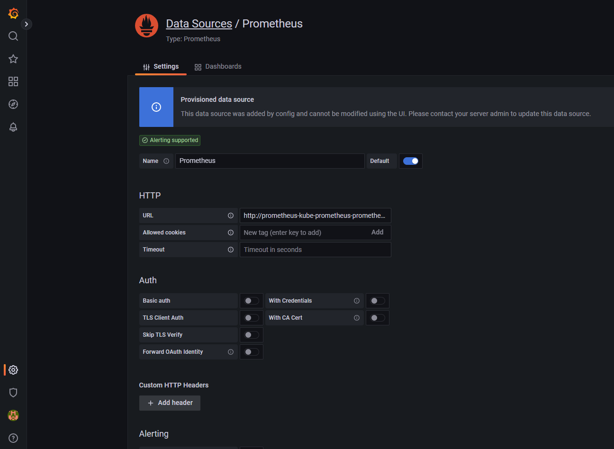

이와 같이 Prometheus가 자동으로 등록이 되어있다.

또한 기본 모니터링 페이지도 아래와 같이 포함되어 있어서 바로 확인이 가능하다.

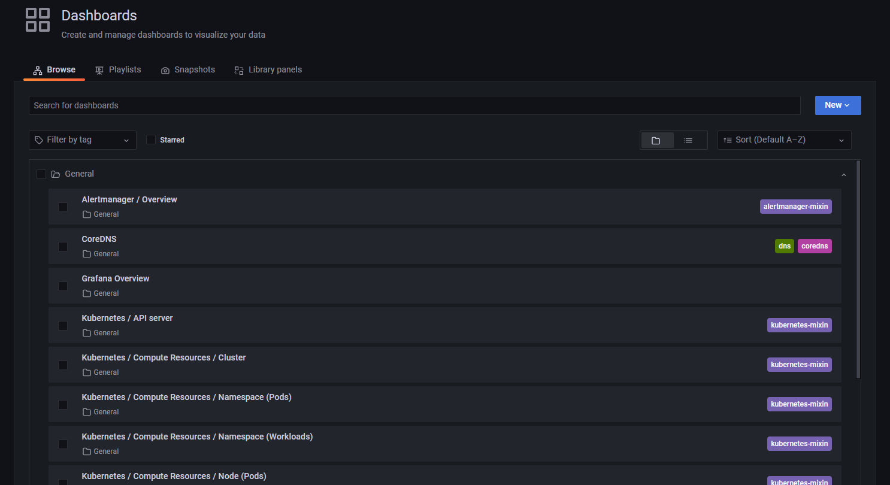

### Built-in 대시보드 확인

빌트인 대시보드를 확인해보면 이와 같이 정제화된 데이터를 확인할 수 있다.

- Kubernetes / Compute Resources / Cluster

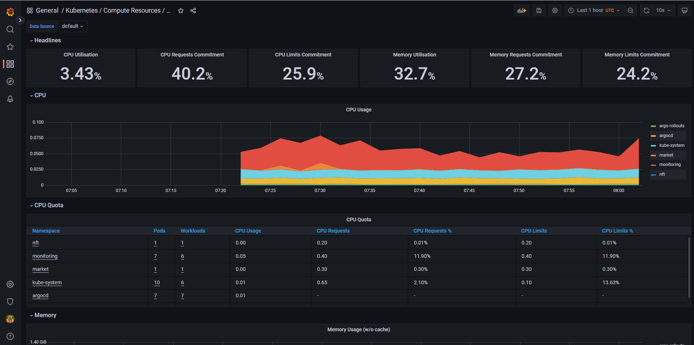

- Kubernetes / Compute Resources / Pod

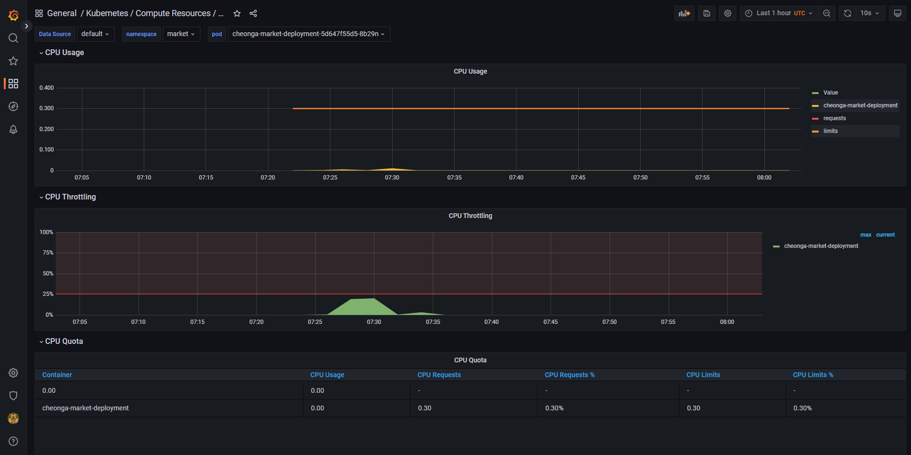

- Node Exporter / Nodes

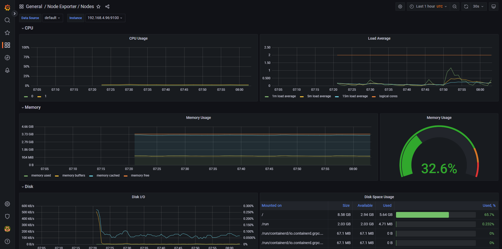

- Node Exporter / Use Method / Cluster

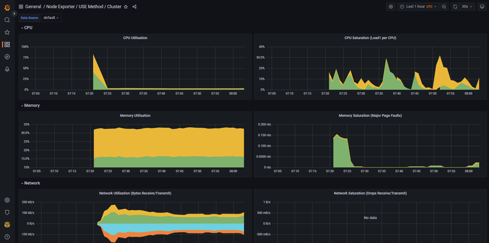

- Node Exporter / USE Method / Node

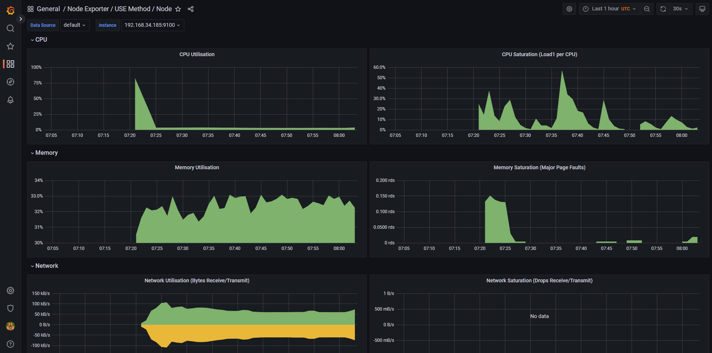

## AlertManager 설정

- AlertManager Slack 알람 설정
- node down 등의 이벤트 발생 시 Slack 수신 확인

AlertManager는 Prometheus의 `Push Alerts` 이벤트를 받아서 이를 이메일, 슬랙 등으로 알리는 역할을 한다. 간단히 `alerts`는 Prometheus가 수집/발생하고 Alertmanager는 이를 전송하는 역할만 한다.

AlertManger 역시 Prometheus, Grafana와 동일하게 Admin 웹 페이지를 제공한다.

만약 서비스가 ClusterIP로 설정되어 있다면, `patch` 명령어를 통해 서비스를 쉽게 변경할 수 있다.

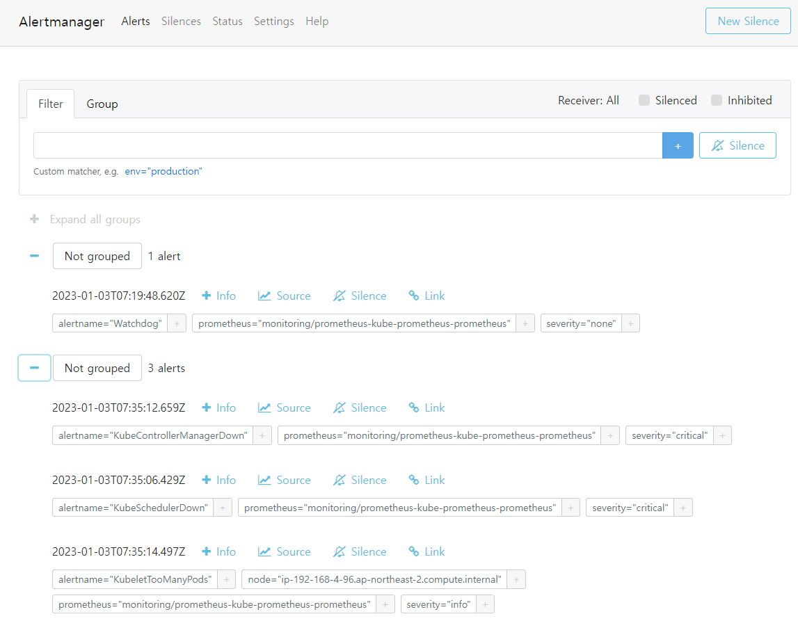

Helm Chart로 Prometheus Stack을 설치하게 되면 기본적으로 다양한 Alert 조건이 포함되어 있다.

예를 들어 Pod 또는 node down, cpu/memory peak 등의 이벤트 발생 시 해당 내역이 자동으로 alert 메시지로 등록된다.

해당 Alert Rule 내역은 AlertManager가 아닌 Prometheus Admin Page(prometheus-kube-prometheus-prometheus)에서 확인 가능하다.

상단 Alerts 메뉴를 틀릭하면 아래와 같이 Prometheus 전체 AlertRule 리스트를 확인할 수 있다.

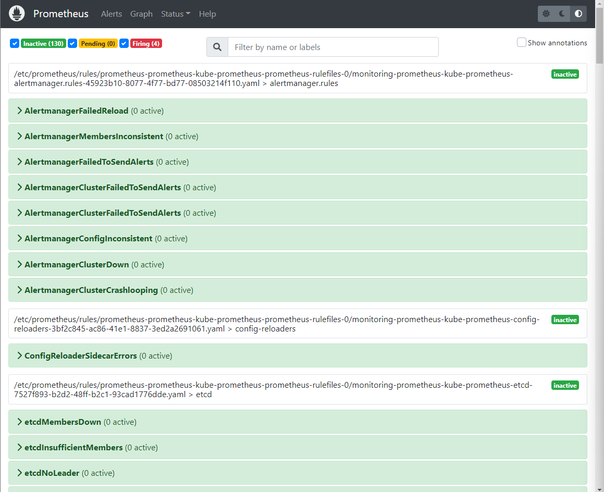

아래는 Alert 발생 사례이다. Alert 조건에 해당하는 이벤트가 발생하면 아래와 같이 Inactive 상태에서 Pending - Firing 상태로 변경이 된다.

아래는 EKS의 노드 중 하나를 강제 종료한 예시이다.

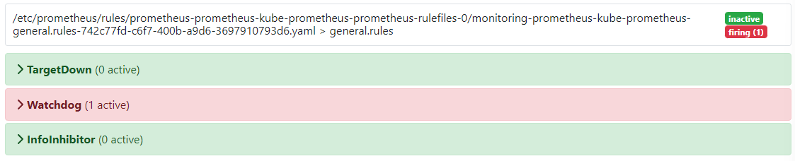

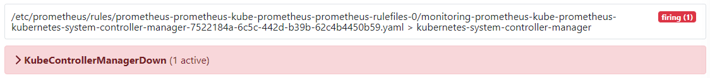

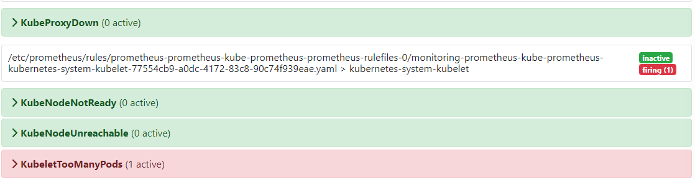

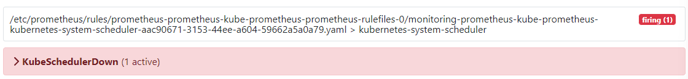

AlertManager GUI 화면에서 Alerts가 발생하지 않은 경우 Watchdog 상태, 즉 현재 정상적으로 동작하고 있는지만 보여준다.

이후 실제 Alerts가 발생하면 아래와 같이 Alerts 메시지가 추가 된 걸 확인할 수 있다.

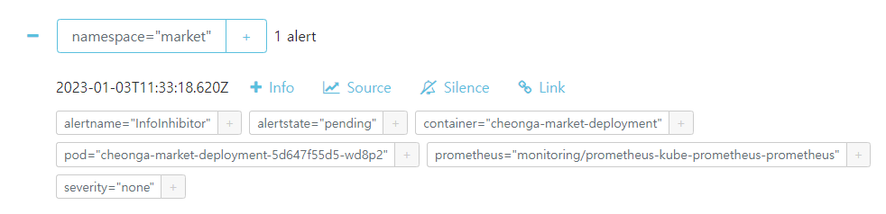

### Kubernetes Alerts 특성

Kubernetes 환경에서는 `desired state`, 즉 선언된 상태 유지가 가장 큰 특징이다. 따라서 Pod 혹은 Node가 다운되어도 자동 재시작하여 항상 미리 선언된 상태를 유지한다. 따라서 VM처럼 Alert 발생 이후 서버에 접속하여 조치를 취하는 것이 아니라 사전에 충분히 고가용성 검증을 하여 장애가 발생하여도 서비스가 자동 복구되도록 상태를 설정하는 것이 중요하다.

### AlertManager E-Mail 수신자 설정

AlertManager는 Slack, E-Mail 등으로 메시지 전달이 가능하다.

`my-values.yml`

```yaml
config:
    global:
      resolve_timeout: 5m
    inhibit_rules:
      - source_matchers:
          - 'severity = critical'
        target_matchers:
          - 'severity =~ warning|info'
        equal:
          - 'namespace'
          - 'alertname'
      - source_matchers:
          - 'severity = warning'
        target_matchers:
          - 'severity = info'
        equal:
          - 'namespace'
          - 'alertname'
      - source_matchers:
          - 'alertname = InfoInhibitor'
        target_matchers:
          - 'severity = info'
        equal:
          - 'namespace'
    route:
      group_by: ['job', 'node', 'namespace', 'pod_name']
      group_wait: 30s
      group_interval: 5m
      repeat_interval: 12h
      receiver: 'email-alert'
      routes:
      - receiver: 'email-alert'
        matchers:
          - alertname =~ "InfoInhibitor|Watchdog"
    receivers:
    - name: 'email-alert'
      email_configs:
      - to: ddung1203@gsneotek.com
        from: ddung1203@gsneotek.com
        smarthost: smtp.gmail.com:587
        auth_username: ddung1203@gsneotek.com
        auth_identity: ddung1203@gsneotek.com
        auth_password: {{ Google 앱 비밀번호 }}
    templates:
    - '/etc/alertmanager/config/*.tmpl'
```

`my-values` 파일을 저장 후 아래 명령으로 prometheus-stack을 업그레이드 한다.

```bash
helm upgrade prometheus . -n monitoring
```

Helm Chart 수정이 완료되면 Alertmanager Admin 페이지에 해당 설정이 Status 메뉴에 반영이 된 것을 확인할 수 있다.

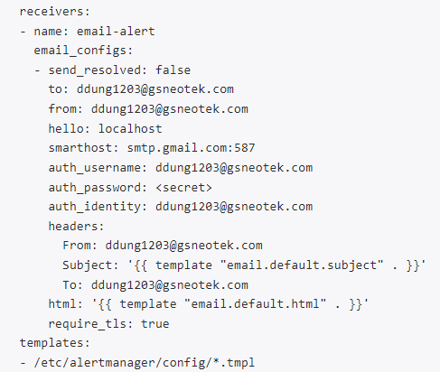

또한 설정이 완료되면 다음과 같이 Mail Alerts를 받을 수 있다.

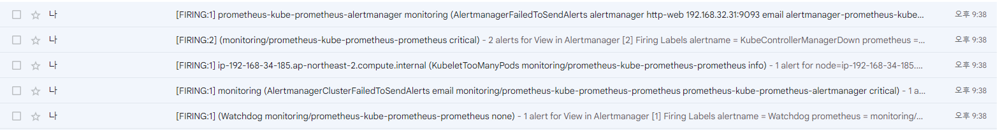

추가로, auth_password의 경우 Google 기준 아래와 같이 앱 비밀번호를 생성하여 입력하면 된다.

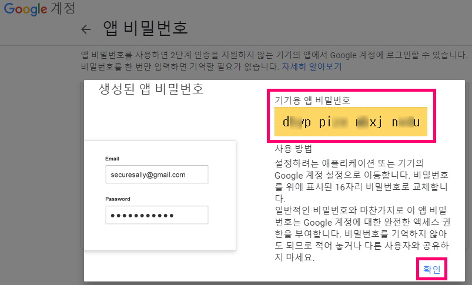
