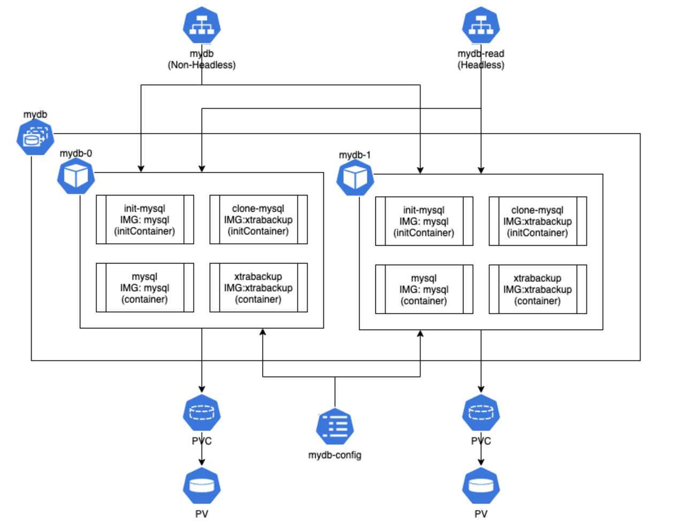
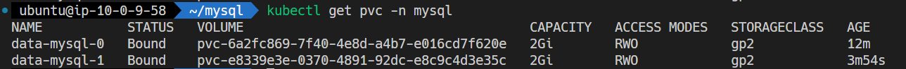
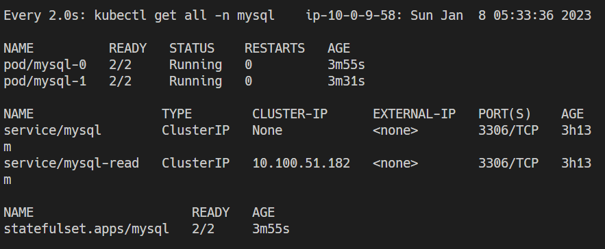
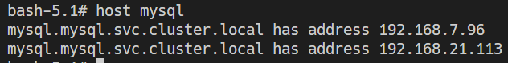
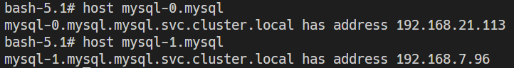
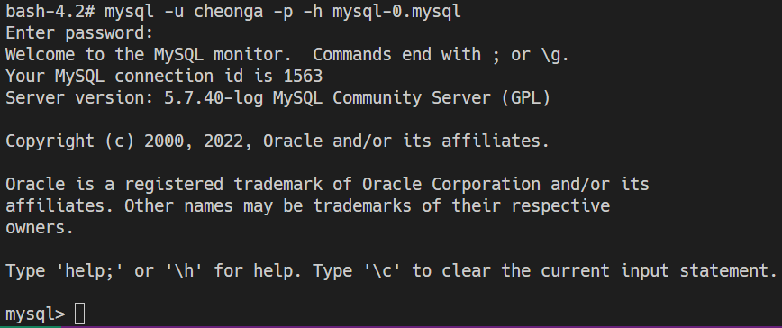

# Run a Stateful Application - MySQL

# 단일 인스턴스 스테이트풀 애플리케이션 실행하기

쿠버네티스 클러스터에서 PV와 Deployment를 사용하여, 단일 인스턴스 스테이트풀 애플리케이션을 실행하는 방법을 확인해보자.

- 사용자 환경의 디스크를 참조하는 PV 생성하기
- MySQL Deployment 생성하기
- 알려진 DNS 이름으로 클러스터의 다른 파드에 MySQL 서비스 노출하기

`mysql-deployment.yaml`

```yaml
apiVersion: v1
kind: Service
metadata:
  name: mysql
spec:
  ports:
  - port: 3306
  selector:
    app: mysql
  clusterIP: None
---
apiVersion: apps/v1
kind: Deployment
metadata:
  name: mysql
spec:
  selector:
    matchLabels:
      app: mysql
  strategy:
    type: Recreate
  template:
    metadata:
      labels:
        app: mysql
    spec:
      containers:
      - image: mysql:5.7
        name: mysql
        env:
          # Use secret in real usage
        - name: MYSQL_ROOT_PASSWORD
          value: password
        ports:
        - containerPort: 3306
          name: mysql
        volumeMounts:
        - name: mysql-persistent-storage
          mountPath: /var/lib/mysql
      volumes:
      - name: mysql-persistent-storage
        persistentVolumeClaim:
          claimName: mysql-pv-claim
```

`mysql-pv.yaml`

```yaml
apiVersion: v1
kind: Service
metadata:
  name: mysql
spec:
  ports:
  - port: 3306
  selector:
    app: mysql
  clusterIP: None
---
apiVersion: apps/v1
kind: Deployment
metadata:
  name: mysql
spec:
  selector:
    matchLabels:
      app: mysql
  strategy:
    type: Recreate
  template:
    metadata:
      labels:
        app: mysql
    spec:
      containers:
      - image: mysql:5.7
        name: mysql
        env:
          # Use secret in real usage
        - name: MYSQL_ROOT_PASSWORD
          value: password
        ports:
        - containerPort: 3306
          name: mysql
        volumeMounts:
        - name: mysql-persistent-storage
          mountPath: /var/lib/mysql
      volumes:
      - name: mysql-persistent-storage
        persistentVolumeClaim:
          claimName: mysql-pv-claim
```

# Kubernetes 스테이트풀셋을 이용한 MySQL 백업 복제본 구성

[EKSworkshop.com](https://www.eksworkshop.com/beginner/170_statefulset/statefulset/)

> 스테이트풀셋이란?
애플리케이션의 상태를 저장하고 관리하는 데 사용되는 쿠버네티스 객체이다. 기존의 Pod를 삭제하고 생성할 때 상태가 유지되지 않는 한계가 있다. 때문에 Pod를 삭제하고 생성하면 완전히 새로운 가상환경이 시작된다. 하지만 필요에 따라 이러한 Pod의 상태를 유지하고 싶을 수 있다. 응용프로그램의 로그나 기타 다른 정보들을 함께 저장하고자 하는 경우 단순히 PV를 하나 마운트해 이를 유지하기는 어렵다. 스테이트풀셋으로 생성되는 Pod는 영구 식별자를 가지고 상태를 유지시킬 수 있다.
> 

### 아키텍처



각각의 파드는 각각의 PVC를 요청하고 다른 PV를 사용함에 따라 별도의 상태를 가질 수 있다. 

MySQL의 백업 복제본을 위해 xtrabackup을 이용하여 복제본을 구성하고,

첫 번째로 생성되는 Pod는 마스터(읽기/쓰기)로,
두 번째부터 생성되는 Pod는 슬레이브(읽기 전용)로 구성된다.

마스터와 슬레이브 Config 파일을 ConfigMap에 등록하고, 서비스는 데이터베이스 쓰기를 위해 마스터를 구별하기 위한 헤드리스 서비스를 구성하고, 데이터베이스 읽기를 위해 일반적인 서비스를 구성한다.

> xtrabackup이란? 
Percona에서 만든 백업 유틸리티로 MySQL에 사용되는 백업이다. MySQL Dump처럼 논리적인 백업이 아니라 물리적인 파일을 통째로 특정 디렉토리에 복사하는 방법을 사용한다. 풀백업, 증분백업, 암호화 백업, 축백업을 지원한다.
> 

[장애와 관련된 XtraBackup 적용기 | 우아한형제들 기술블로그](https://techblog.woowahan.com/2576/)

`mysql-cm.yaml`

```yaml
apiVersion: v1
kind: ConfigMap
metadata:
  name: mysql-config
  labels:
    app: mysql
data:
  master.cnf: |
    [mysqld]
    log-bin
  slave.cnf: |
    [mysqld]
    super-read-only
```

MySQL에서 사용할 ConfigMap 리소스, 데이터베이스 설정 파일이다.

마스터 슬레이브를 독립적으로 제어할 수 있도록 한다.

마스터는 복제 로그를 슬레이브로 제공하는 설정이고,
슬레이브는 읽기 전용으로 쓰기를 금지하도록 하는 설정이다.

마스터의 `master.cnf` 설정은 슬레이브가 데이터베이스를 복제하기 위한 복제 로그를 남기도록 하는 설정이고 슬레이브의 `slave.cnf` 파일에는 읽기 전용으로 구성하기 위한 설정이다.

`mysql-svc-write.yaml`

```yaml
apiVersion: v1
kind: Service
metadata:
  name: mysql
  labels:
    app: mysql
spec:
  ports:
  - name: mysql
    port: 3306
  clusterIP: None
  selector:
    app: mysql
```

데이터베이스 쓰기를 위한 헤드리스 서비스이다.

각 Pod에 대해 따로 접근하기 위해 헤드리스 서비스로 정의되었고, 특히 마스터를 구별하기 위해 반드시 필요하다.

`mysql-svc-read.yaml`

```yaml
apiVersion: v1
kind: Service
metadata:
  name: mysql-read
  labels:
    app: mysql
spec:
  ports:
  - name: mysql
    port: 3306
  selector:
    app: mysql
```

데이터베이스 읽기를 위한 비-헤드리스 서비스이다.

일반적인 ClusterIP 서비스이며, mysql-read 주소로 접근했을 때 부하 분산을 통해 아무 노드나 접근할 수 있도록 한다.

`mysql-sts.yaml`

```yaml
apiVersion: apps/v1
kind: StatefulSet
metadata:
  namespace: mysql
  name: mysql
spec:
  selector:
    matchLabels:
      app: mysql
  serviceName: mysql
  replicas: 2
  template:
    metadata:
      labels:
        app: mysql
    spec:
      initContainers:
      - name: init-mysql
        image: mysql:5.7
        command:
        - bash
        - "-c"
        - |
          set -ex
          # Generate mysql server-id from pod ordinal index.
          [[ `uname -n` =~ -([0-9]+)$ ]] || exit 1
          ordinal=${BASH_REMATCH[1]}
          echo [mysqld] > /mnt/conf.d/server-id.cnf
          # Add an offset to avoid reserved server-id=0 value.
          echo server-id=$((100 + $ordinal)) >> /mnt/conf.d/server-id.cnf
          # Copy appropriate conf.d files from config-map to emptyDir.
          if [[ $ordinal -eq 0 ]]; then
            cp /mnt/config-map/master.cnf /mnt/conf.d/
          else
            cp /mnt/config-map/slave.cnf /mnt/conf.d/
          fi
        volumeMounts:
        - name: conf
          mountPath: /mnt/conf.d
        - name: config-map
          mountPath: /mnt/config-map
      - name: clone-mysql
        image: gcr.io/google-samples/xtrabackup:1.0
        command:
        - bash
        - "-c"
        - |
          set -ex
          # Skip the clone if data already exists.
          [[ -d /var/lib/mysql/mysql ]] && exit 0
          # Skip the clone on leader (ordinal index 0).
          [[ `uname -n` =~ -([0-9]+)$ ]] || exit 1
          ordinal=${BASH_REMATCH[1]}
          [[ $ordinal -eq 0 ]] && exit 0
          # Clone data from previous peer.
          ncat --recv-only mysql-$(($ordinal-1)).mysql 3307 | xbstream -x -C /var/lib/mysql
          # Prepare the backup.
          xtrabackup --prepare --target-dir=/var/lib/mysql
        volumeMounts:
        - name: data
          mountPath: /var/lib/mysql
          subPath: mysql
        - name: conf
          mountPath: /etc/mysql/conf.d
      containers:
      - name: mysql
        image: mysql:5.7
        env:
        - name: MYSQL_ALLOW_EMPTY_PASSWORD
          value: "1"
        ports:
        - name: mysql
          containerPort: 3306
        volumeMounts:
        - name: data
          mountPath: /var/lib/mysql
          subPath: mysql
        - name: conf
          mountPath: /etc/mysql/conf.d
        resources:
          requests:
            cpu: 500m
            memory: 1Gi
        livenessProbe:
          exec:
            command: ["mysqladmin", "ping"]
          initialDelaySeconds: 30
          periodSeconds: 10
          timeoutSeconds: 5
        readinessProbe:
          exec:
            # Check we can execute queries over TCP (skip-networking is off).
            command: ["mysql", "-h", "127.0.0.1", "-e", "SELECT 1"]
          initialDelaySeconds: 5
          periodSeconds: 2
          timeoutSeconds: 1
      - name: xtrabackup
        image: gcr.io/google-samples/xtrabackup:1.0
        ports:
        - name: xtrabackup
          containerPort: 3307
        command:
        - bash
        - "-c"
        - |
          set -ex
          cd /var/lib/mysql

          # Determine binlog position of cloned data, if any.
          if [[ -f xtrabackup_slave_info ]]; then
            # XtraBackup already generated a partial "CHANGE MASTER TO" query
            # because we're cloning from an existing follower.
            mv xtrabackup_slave_info change_master_to.sql.in
            # Ignore xtrabackup_binlog_info in this case (it's useless).
            rm -f xtrabackup_binlog_info
          elif [[ -f xtrabackup_binlog_info ]]; then
            # We're cloning directly from leader. Parse binlog position.
            [[ `cat xtrabackup_binlog_info` =~ ^(.*?)[[:space:]]+(.*?)$ ]] || exit 1
            rm xtrabackup_binlog_info
            echo "CHANGE MASTER TO MASTER_LOG_FILE='${BASH_REMATCH[1]}',\
                  MASTER_LOG_POS=${BASH_REMATCH[2]}" > change_master_to.sql.in
          fi

          # Check if we need to complete a clone by starting replication.
          if [[ -f change_master_to.sql.in ]]; then
            echo "Waiting for mysqld to be ready (accepting connections)"
            until mysql -h 127.0.0.1 -e "SELECT 1"; do sleep 1; done

            echo "Initializing replication from clone position"
            # In case of container restart, attempt this at-most-once.
            mv change_master_to.sql.in change_master_to.sql.orig
            mysql -h 127.0.0.1 <<EOF
          $(<change_master_to.sql.orig),
            MASTER_HOST='mysql-0.mysql',
            MASTER_USER='root',
            MASTER_PASSWORD='',
            MASTER_CONNECT_RETRY=10;
          START SLAVE;
          EOF
          fi

          # Start a server to send backups when requested by peers.
          exec ncat --listen --keep-open --send-only --max-conns=1 3307 -c \
            "xtrabackup --backup --slave-info --stream=xbstream --host=127.0.0.1 --user=root"
        volumeMounts:
        - name: data
          mountPath: /var/lib/mysql
          subPath: mysql
        - name: conf
          mountPath: /etc/mysql/conf.d
        resources:
          requests:
            cpu: 100m
            memory: 100Mi
      volumes:
      - name: conf
        emptyDir: {}
      - name: config-map
        configMap:
          name: mysql-config
  volumeClaimTemplates:
  - metadata:
      name: data
    spec:
      accessModes: ["ReadWriteOnce"]
      storageClassName: mysql-gp2
      resources:
        requests:
          storage: 2Gi
```

`statefulset.spec.template.initContainers`

컨트롤러가 Pod/Container 최초 배포 시 실행할 초기화 작업이다.

복제 작업 시 사용할 각 MySQL 서버의 ID를 지정하는 부분과, 복제 작업을 위한 초기화 작업이 포함되어 있다.

`statefuleset.spec.template.containers`

애플리케이션 Container를 정의하는 부분이며, 하나의 Pod에 Container는 2개가 있다.

MySQL Container는 MySQL 애플리케이션을 작동시킬 Container이며, xtrabackup Container는 마스터-슬레이브 간에 데이터베이스의 복제를 담당하는 컨테이너이다.

스테이트풀셋은 PVC 템플릿을 사용하여 각 파드마다 다른 PVC를 사용할 수 있도록 한다.

별도로 StorageClass를 정의하지 않았으므로 기본 스토리지 클래스가 적용될 것이다. 기본 스토리지 클래스 설정이 안되어있다면 Pod가 Pending으로 작동되지 않는다.

> EKS에서 영구 스토리지를 사용하기 위해선 `AWS EKS 패포.md`를 참고하여 EBS for CSI를 통해 추가 기능을 업데이트한다.
> 




위 그림과 같은 StorageClass가 업데이트됨을 확인할 수 있다.



`mysql-*` Pod가 생성되었으며, 초기화 작업이 진행이 된다.

- 초기화할 작업: init-mysql, clone-mysql

파드의 복제본 개수가 2개이기 때문에 두 개의 PVC와 PV가 생성되었다.

## MySQL 데이터베이스 확인

아래 명령어를 통해 헤드리스 서비스가 적용된 레플리카셋이 실행한 파드의 주소를 확인해보면 아래 그림과 같다.

```bash
kubectl run mysql-client -it --image=ghcr.io/c1t1d0s7/network-multitool --rm bash -n mysql
```





사용자에 맞게 user와 database를 생성한다.

`mysql-client.yaml`

```yaml
apiVersion: v1
kind: Pod
metadata:
  name: mysql-clieny
spec:
  containers:
  - image: mysql:5.7
    name: mysql-client
    env:
      # Use secret in real usage
    - name: MYSQL_ROOT_PASSWORD
      value: password
    ports:
    - containerPort: 3306
      name: mysql-client
```

사용자 생성 후 정상적으로 접근이 가능하다. 또한 마스터 MySQL만 권한이 있기 때문에 `mysql-0` 으로 접속하여 Write해야 한다.



Kubernetes의 DNS은 아래와 같다.

`appname.default-subdomain.default.svc.cluster.local`

따라서, 다른 네임스페이스에 있는 Pod에서 위의 DB를 접근하기 위해선 `mysql-0.mysql.mysql` 로 접근해야 한다.

> MySQL UTF-8 설정
> 

[MySQL 한글깨짐현상 두가지 해결방법 : cmd와 Workbench, 이클립스와 MYSQL연결](https://sowon-dev.github.io/2020/07/01/200702jspi2/)

[MySQL character set 확인 및 변경](https://bstar36.tistory.com/307)