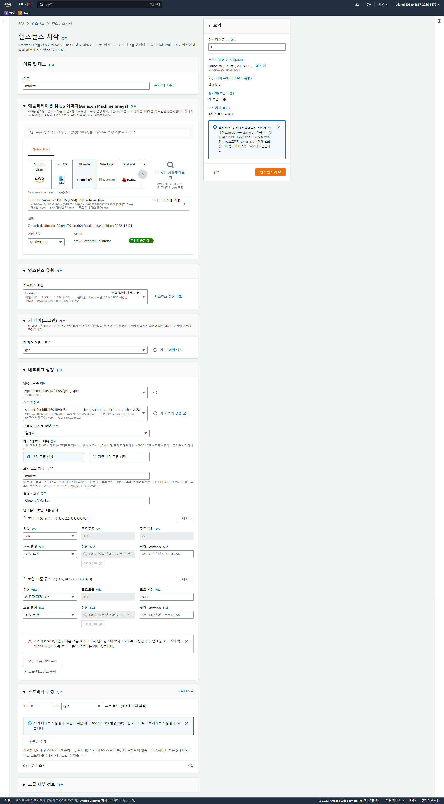

# Market

## AWS 설정

### 1. EC2 생성



키 페어의 경우

```bash
cd .ssh
cat id_rsa.pub
```

`id_rsa.pub` 을 네트워크 및 보안 - 키 페어 에 등록함으로서 


pem키나 복잡한 과정없이 ssh가 가능하다.

### 2. RDS 생성


EC2에 접속해서 아래 코드를 작성한다.

```bash
# RDS 엔드포인트로 접속
mysql -u root -p -h market.ce8ficdn2mar.ap-northeast-2.rds.amazonaws.co
m

mysql> create database market;
Query OK, 1 row affected (0.01 sec)

mysql> create user cheonga@'%' identified by 'cheonga!';
Query OK, 0 rows affected (0.01 sec)

mysql> grant all privileges on market.* to cheonga@'%';
Query OK, 0 rows affected (0.00 sec)

mysql> flush privileges;
Query OK, 0 rows affected (0.00 sec)

mysql> exit
Bye

```

DDL은 다음과 같다.

```sql
create table tb_user(
    user_id INT PRIMARY KEY AUTO_INCREMENT,
	  user_identification VARCHAR(255) NOT NULL unique key,
    user_email VARCHAR(255)NOT NULL,
    user_name VARCHAR(255) NOT NULL,
    user_created DATETIME DEFAULT CURRENT_TIMESTAMP,
    user_birth VARCHAR(255) ,
    user_password VARCHAR(255)NOT NULL,
    user_gender VARCHAR(255)NOT NULL,
    user_phone VARCHAR(255)NOT NULL,
    user_level TINYINT(1) NOT NULL default 0
  );
  
  create table tb_address(
    address_id INT PRIMARY KEY AUTO_INCREMENT,
  user_id INT NOT NULL,
  FOREIGN KEY(user_id) REFERENCES tb_user(user_id),
  address_zip VARCHAR(255) NOT NULL,
  address_detail VARCHAR(255) NOT NULL,
  address_detail2 VARCHAR(255) NOT NULL,
  address_phone VARCHAR(255) NOT NULL,
  address_recipient VARCHAR(255) NOT NULL,
  address_default TINYINT(1) NOT NULL default 0
  );
  
  create table tb_brand(
	  brand_id INT PRIMARY KEY AUTO_INCREMENT,
	  brand_created DATETIME DEFAULT CURRENT_TIMESTAMP,
	  brand_img varchar(200) NOT NULL,
	  brand_name VARCHAR(255)NOT NULL,
	  brand_desc VARCHAR(300) NOT NULL
	
  );
  
  create table tb_category(
    category_code INT PRIMARY KEY NOT NULL,
    category_code2 int,
    FOREIGN KEY(category_code2) REFERENCES tb_category(category_code),
    category_name VARCHAR(255)NOT NULL,
    category_depth int(2) not null
  );
  
 create table tb_discount(
	  discount_id INT PRIMARY KEY AUTO_INCREMENT,
	  discount_name varchar(255) NOT NULL,
	  discount_desc VARCHAR(255) NOT NULL,
	  discount_explanation VARCHAR(255) NOT NULL,
	  discount_thumbnailImg varchar(200) NOT NULL,
	  discount_rate INT NOT NULL,
	  discount_start date NOT NULL,
	  discount_end date NOT NULL,
	  discount_apply TINYINT(1) NOT NULL default 0,
	  discount_state TINYINT(1) NOT NULL default 0
 );
 
 create table tb_notice(
    notice_id INT PRIMARY KEY AUTO_INCREMENT,
    notice_title varchar(255) NOT NULL,
    notice_writer varchar(255) default "Market" NOT NULL,
    notice_created datetime default current_timestamp NOT NULL,
    notice_view INT default 0 NOT NULL,
    notice_content varchar(500) NOT NULL
 );
 
 create table tb_product(
	   product_id INT PRIMARY KEY AUTO_INCREMENT,
	   brand_id INT NOT NULL,
	   FOREIGN KEY(brand_id) REFERENCES tb_brand(brand_id)  on delete cascade,
	   category_code INT NOT NULL,
	   FOREIGN KEY(category_code) REFERENCES tb_category(category_code)  on delete cascade,
	   discount_id INT default null,
	   FOREIGN KEY(discount_id) REFERENCES tb_discount(discount_id)  on delete set null,	
	   product_created DATETIME DEFAULT CURRENT_TIMESTAMP,
	   product_name VARCHAR(255)NOT NULL,
   product_price INT NOT NULL,
	   product_quantity INT NOT NULL,
	   product_sales_quantity INT NOT NULL default 0,
	   product_desc VARCHAR(300) NOT NULL,
	   product_material VARCHAR(255)NOT NULL,
	   product_volume INT NOT NULL,
	   on_sale TINYINT(1) NOT NULL default 0,
   product_descImg varchar(200) NOT NULL,
	   product_img varchar(200) NOT NULL
 );
 
 create table tb_cart(
	cart_id INT PRIMARY KEY AUTO_INCREMENT,
	user_id INT,
	FOREIGN KEY(user_id) REFERENCES tb_user(user_id),
    product_id INT NOT NULL,
    FOREIGN KEY(product_id) REFERENCES tb_product(product_id),
    product_count INT NOT NULL
 );
 
  create table tb_order_state (
 	 order_state_id int primary key auto_increment,
    order_state_title varchar(250) not null
 );
 
 
 create table tb_order(
	  order_id INT PRIMARY KEY AUTO_INCREMENT,
	  user_id INT,
	  FOREIGN KEY(user_id) REFERENCES tb_user(user_id),
	  order_state_id int NOT NULL,
	  FOREIGN KEY(order_state_id) REFERENCES tb_order_state(order_state_id),
	  buyer_name varchar(255) NOT NULL,
	  buyer_email varchar(255) NOT NULL,
	  buyer_phone varchar(255) NOT NULL,
	  recipient_name varchar(255) NOT NULL,
	  recipient_zip VARCHAR(255) NOT NULL,
	  recipient_address VARCHAR(255) NOT NULL,
	  recipient_phone VARCHAR(255) NOT NULL,
	  order_request VARCHAR(255),
	  order_created DATETIME DEFAULT CURRENT_TIMESTAMP,
	  order_payment_method varchar(255) NOT NULL,
	  order_products_price INT NOT NULL,
	  order_discount_price INT NOT NULL,
	  order_delivery_price INT NOT NULL,
	  order_total_price INT NOT NULL,
	  order_tracking_number varchar(255)
 );
 
  create table tb_review (
 	review_id int primary key auto_increment,
	user_id INT not null,
	FOREIGN KEY(user_id) REFERENCES tb_user(user_id),
    product_id int not null,
    FOREIGN KEY(product_id) REFERENCES tb_product(product_id),
	review_title varchar(250) not null,
    review_created datetime default current_timestamp,
	review_star int not null,
    review_content varchar(255) not null,
    review_view INT default 0 NOT NULL,
    review_img varchar(200)
 );
 
 create table tb_order_detail (
	order_detail_id INT PRIMARY KEY AUTO_INCREMENT,
	order_id INT not null,
    FOREIGN KEY(order_id) REFERENCES tb_order(order_id),
    product_id int not null,
    FOREIGN KEY(product_id) REFERENCES tb_product(product_id),
	  review_id int,
    FOREIGN KEY(review_id) REFERENCES tb_review(review_id),
    product_count int not null,
    product_price int not null
 );
 

 
  create table tb_question_category (
	  question_category_id int primary key auto_increment,
    question_category_title varchar(250) not null
 );
 
  create table tb_answer (
	answer_id int primary key auto_increment,
	question_category_id INT not null,
	FOREIGN KEY(question_category_id) REFERENCES tb_question_category(question_category_id),
    answer_created datetime default current_timestamp,
    answer_title varchar(250) not null,
    answer_content varchar(255) not null
 );
 
 create table tb_question (
 	question_id int primary key auto_increment,
	user_id INT not null,
	FOREIGN KEY(user_id) REFERENCES tb_user(user_id) on delete cascade,
	question_category_id INT not null,
	FOREIGN KEY(question_category_id) REFERENCES tb_question_category(question_category_id) on delete cascade,
    order_id int default null,
    FOREIGN KEY(order_id) REFERENCES tb_order(order_id) on delete cascade,
	product_id int default null,
    FOREIGN KEY(product_id) REFERENCES tb_product(product_id) on delete cascade,
	answer_id int default null,
    FOREIGN KEY(answer_id) REFERENCES tb_answer(answer_id) on delete set null,
    question_created datetime default current_timestamp,
    question_title varchar(250) not null,
    question_content varchar(255) not null,
    question_phone varchar(250) default null
 );
```

### 3. S3 Bucket 설정


버킷을 퍼블릭으로 설정하기 위해 버킷 정책을 편집한다.

`버킷 정책생성기`

```json
{
  "Id": "Policy1672290502917",
  "Version": "2012-10-17",
  "Statement": [
    {
      "Sid": "Stmt1672290501981",
      "Action": [
        "s3:GetObject"
      ],
      "Effect": "Allow",
      "Resource": "arn:aws:s3:::s3.market.ict.mju.com/*",
      "Principal": "*"
    }
  ]
}
```

## EC2 내 tomcat WAS 구축

1. JDK 및 maven 설치

```bash
# 저장소 업데이트
sudo apt update

# OpenJDK 8 설치
sudo apt install openjdk-8-jdk

# Maven 설치
sudo apt install maven
```

1. Apache Tomcat 설치

[Apache Tomcat®](https://tomcat.apache.org/)


Tomcat9의 tar.gz 파일의 링크를 복사한다.

```bash
# wget 명령어를 실행하여 다운로드 한 후 압축 해제
wget https://dlcdn.apache.org/tomcat/tomcat-9/v9.0.70/bin/apache-tomcat-9.0.70.tar.gz
tar -zxvf apache-tomcat-9.0.70.tar.gz
```

1. tomcat 실행

tomcat은 tomcat 설치 경로 아래 `bin/startup.sh` 로 시작할 수 있다.

```bash
./apache-tomcat-9.0.70/bin/startup.sh
```


1. mvn clean package

clean : 컴파일 된 결과물인 `.target` 폴더를 지워주는 메이븐 명령어이고

install, package : 프로젝트를 빌드하여 jar 실행 파일을 만들어주는 명령어

mvn install과 mvn package의 차이점은 로컬 maven 폴더에 jar 파일을 저장해주냐 안해주냐의 차이이다.

pakage는 생성된 jar 파일이 `.target` 폴더에 위치하고

install은 생성된 jar 파일이 `.target` 하위와 로컬 mvn 폴더 내의 repository 폴더가 생성된다.

```bash
git clone https://github.com/CheongAA/web-market.git

cd web-market
mvn clean package
```

1. tomcat 배포

tomcat은 기본적으로 설치 경로의 webapps 아래에 war 파일이 존재하면 자동으로 압축을 풀고 애플리케이션을 실행한다.

이때 war 파일의 이름을 ROOT로 지정하면 별다른 설정 없이 애플리케이션을 실행할 수 있다.

하지만 이번엔 배포할 애플리케이션의 이름을 그대로 사용하겠다.

```bash
cd apache-tomcat-9.0.70/webapps

mv ict-1.0.0-BUILD-SNAPSHOT.war
```

`server.xml` 에서 Host path 설정은 다음과 같다.

```xml
<Host name="localhost"  appBase="webapps" unpackWARs="true" autoDeploy="true">
        <Context path="/" docBase="ict-1.0.0-BUILD-SNAPSHOT"  reloadable="false" > </Context>
```

`bin` 폴더 내에서 `./startup.sh` 실행

배포 완료


## AWS Target Groups

기본적으로 로드 밸런서는 대상 그룹에 대해 지정한 프로토콜과 번호를 사용하여 등록된 대상으로 요청을 전송한다.


위와 같이 대상 그룹 생성 후 

## AWS ELB

ELB(Elastic Load Balancer)란 트래픽의 분산을 통해 부하를 줄여주는 기능을 한다. AWS에서는 ELB를 통해 로드밸런싱을 하여 다량의 트래픽에도 서버가 죽지않도록 관리해주는 고가용성 역할을 하게된다.

이번에는 ELB를 생성하여 웹 서버에 접속하고 실제 로드밸런싱이 제대로 이루어지고 있는지 확인해보자.

Elastic LoadBanlancer 종류

- ALB(Application Load Balancer): HTTP 및 HTTPS 트래픽을 사용하는 웹 애플리케이션을 위한 유연한 기능이 필요한 경우 사용
- NLB(Network Load Balancer): 애플리케이션에 초고성능, 대규모 TLS 오프로딩, 중앙 집중화된 인증서 배포, UDP에 대한 지원 및 고정 IP 주소가 필요한 경우 사용
- GLB(Gateway Load Balancer): GENEVE를 지원하는 타사 가상 어플라이언스 플릿을 배포 및 관리해야 할 경우 사용

Application Load Balancer 생성


설정은 다음과 같다.


Auto Scaling 그룹을 위해선 시작 템플릿을 생성해야 하며 시작 템플릿의 설정은 다음과 같다.


Auto Scaling 설정은 다음과 같다.


부하 전


부하 생성 후


